# Terminator themes
> A great collection of [Terminator](http://www.tenshu.net/terminator/) themes.

# Contents

- [Usage](#usage)
- [Themes](#themes)


# Usage:

- Just copy and paste the lines below your favorite theme on your terminator config file (~/.config/terminator/config) in the profiles section.
- Restart terminator and choose the profile.


If the above directory does not exist create it by doing the following:

```bash
$ mkdir -p ~/.config/terminator/
$ touch ~/.config/terminator/config
```
The basic structure of config file is:
```bash
[global_config]
[keybindings]
[layouts]
  [[default]]
    [[[child1]]]
      parent = window0
      type = Terminal
    [[[window0]]]
      parent = ""
      type = Window
[plugins]
[profiles]
  [[default]]

```


[⬆ Back to top](#contents)

# Themes

## Aci

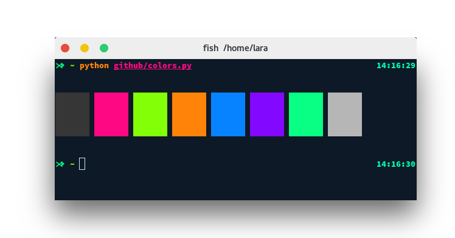
```bash
[[Aci]]
  background_color = "#0d1926"
  background_image = None
  cursor_color = "#c4e9ff"
  foreground_color = "#b4e1fd"
  palette = "#363636:#ff0883:#83ff08:#ff8308:#0883ff:#8308ff:#08ff83:#b6b6b6:#363636:#ff0883:#83ff08:#ff8308:#0883ff:#8308ff:#08ff83:#b6b6b6"


```

## Aco
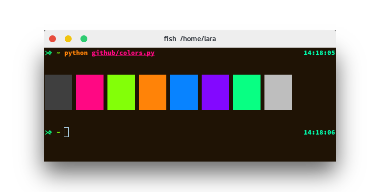
```bash
[[aco]]
   background_color = "#1f1305"
   background_image = None
   cursor_color = "#bae2fb"
   foreground_color = "#b4e1fd"
   palette = "#3f3f3f:#ff0883:#83ff08:#ff8308:#0883ff:#8308ff:#08ff83:#bebebe:#474747:#ff1e8e:#8eff1e:#ff8e1e:#0883ff:#8e1eff:#1eff8e:#c4c4c4"

```
---
## Azu
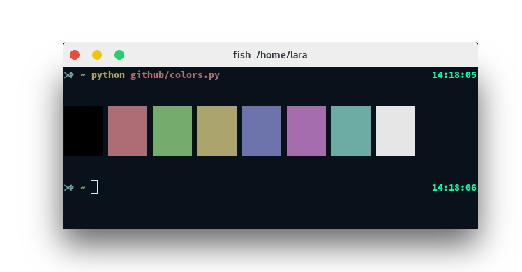
```bash
[[azu]]
  background_color = "#09111a"
  background_image = None
  cursor_color = "#d2e8fc"
  foreground_color = "#d9e6f2"
  palette = "#000000:#ac6d74:#74ac6d:#aca46d:#6d74ac:#a46dac:#6daca4:#e6e6e6:#262626:#d6b8bc:#bcd6b8:#d6d3b8:#b8bcd6:#d3b8d6:#b8d6d3:#ffffff"
```
---
## Bim
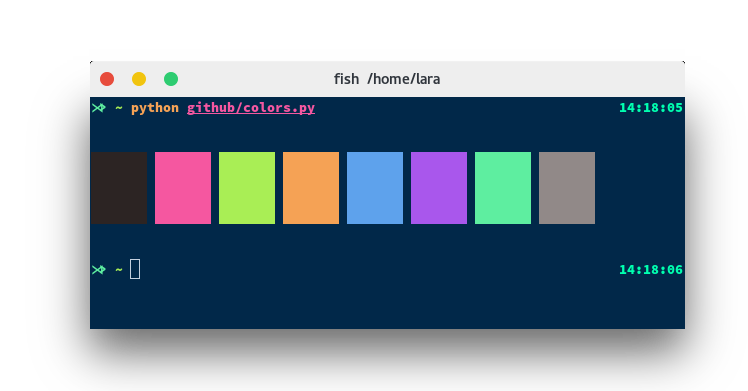
```bash
[[bim]]
  background_color = "#012849"
  background_image = None
  cursor_color = "#c4d0de"
  foreground_color = "#a9bed8"
  palette = "#2c2423:#f557a0:#a9ee55:#f5a255:#5ea2ec:#a957ec:#5eeea0:#918988:#918988:#f579b2:#bbee78:#f5b378:#81b3ec:#bb79ec:#81eeb2:#f5eeec"
```
---

## Cai
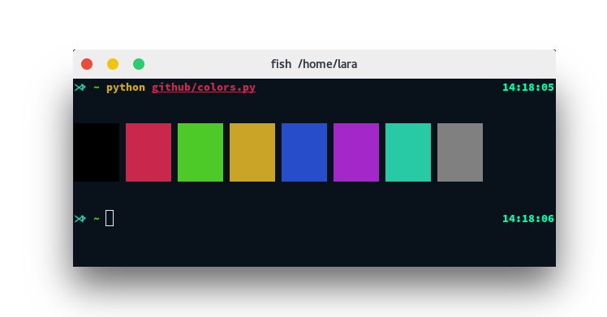
```bash
[[cai]]
  background_color = "#09111a"
  background_image = None
  cursor_color = "#e3eef9"
  foreground_color = "#d9e6f2"
  palette = "#000000:#ca274d:#4dca27:#caa427:#274dca:#a427ca:#27caa4:#808080:#808080:#e98da3:#a3e98d:#e9d48d:#8da3e9:#d48de9:#8de9d4:#ffffff"
```
---
## Chalc
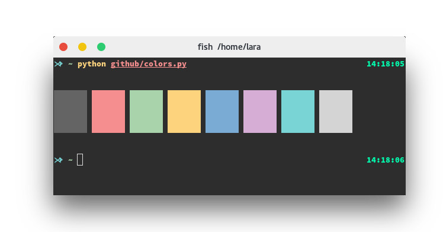
```bash
[[chalc]]
    background_color = "#2d2d2d"
    background_image = None
    cursor_color = "#e0dddd"
    foreground_color = "#d4d4d4"
    palette = "#646464:#F58E8E:#A9D3AB:#FED37E:#7AABD4:#D6ADD5:#79D4D5:#D4D4D4:#646464:#F58E8E:#A9D3AB:#FED37E:#7AABD4:#D6ADD5:#79D4D5:#D4D4D4"
```
---
## Cobalt
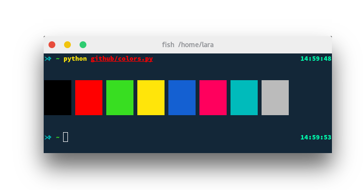
```bash
[[cobalt]]
    background_color = "#132738"
    background_image = None
    cursor_color = "#aaaaaa"
    foreground_color = "#ffffff"
    palette = "#000000:#ff0000:#38de21:#ffe50a:#1460d2:#ff005d:#00bbbb:#bbbbbb:#555555:#ff0000:#38de21:#ffe50a:#1460d2:#ff55ff:#6ae3fa:#ffffff"
```
---
## Dracula
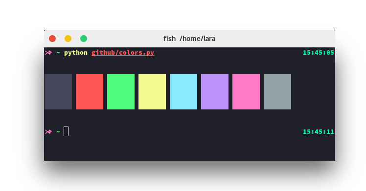
```bash
[[dracula]]
    background_color = "#1e1f29"
    background_image = None
    cursor_color = "#aaaaaa"
    foreground_color = "#f8f8f2"
    palette = "#44475a:#ff5555:#50fa7b:#f1fa8c:#8be9fd:#bd93f9:#ff79c6:#94a3a5:#000000:#ff5555:#50fa7b:#f1fa8c:#8be9fd:#bd93f9:#ff79c6:#ffffff"
```
---
## Elementary
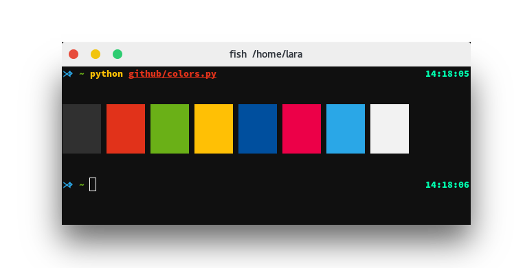
```bash
[[elementary]]
    background_color = "#101010"
    background_image = None
    cursor_color = "#ffffff"
    foreground_color = "#f2f2f2"
    palette = "#303030:#e1321a:#6ab017:#ffc005:#004f9e:#ec0048:#2aa7e7:#f2f2f2:#5d5d5d:#ff361e:#7bc91f:#ffd00a:#0071ff:#ff1d62:#4bb8fd:#a020f0"
```
---
## Elic
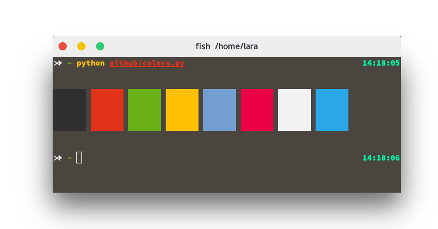
```bash
[[elic]]
  background_color = "#4a453e"
  background_image = None
  cursor_color = "#eeecec"
  foreground_color = "#f2f2f2"
  palette = "#303030:#e1321a:#6ab017:#ffc005:#729FCF:#ec0048:#f2f2f2:#2aa7e7:#5d5d5d:#ff361e:#7bc91f:#ffd00a:#0071ff:#ff1d62:#4bb8fd:#a020f0"
```
---
## Elio
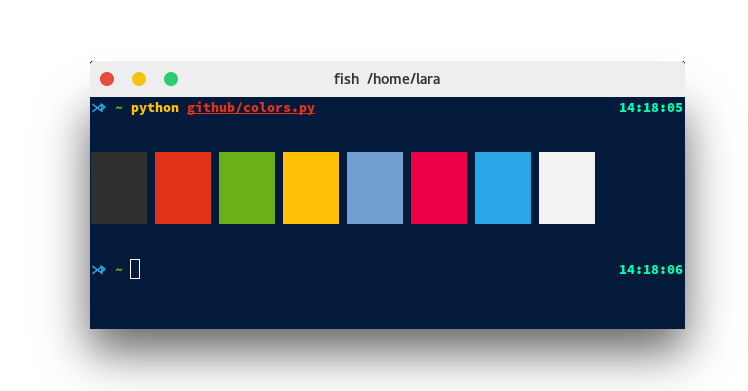
```bash
[[elio]]
    background_color = "#041a3b"
    background_image = None
    cursor_color = "#fbfbfb"
    foreground_color = "#f2f2f2"
    palette = "#303030:#e1321a:#6ab017:#ffc005:#729FCF:#ec0048:#2aa7e7:#f2f2f2:#5d5d5d:#ff361e:#7bc91f:#ffd00a:#0071ff:#ff1d62:#4bb8fd:#a020f0"
```
---
## Flat
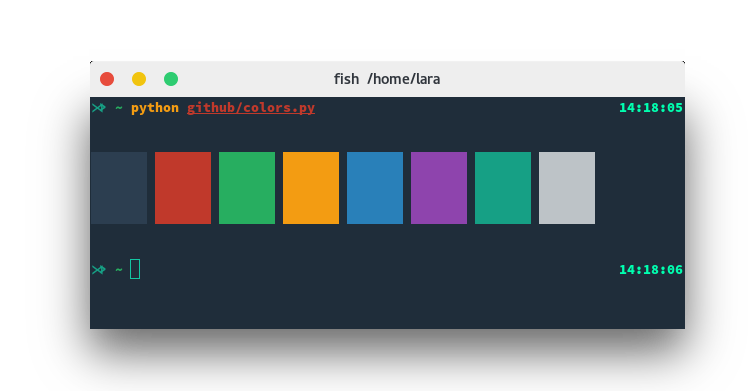
```bash
[[flat]]
   background_color = "#1f2d3a"
   background_image = None
   cursor_color = "#13c5a2"
   foreground_color = "#1abc9c"
   palette = "#2c3e50:#c0392b:#27ae60:#f39c12:#2980b9:#8e44ad:#16a085:#bdc3c7:#34495e:#e74c3c:#2ecc71:#f1c40f:#3498db:#9b59b6:#2AA198:#ecf0f1"
```
---
## Freya
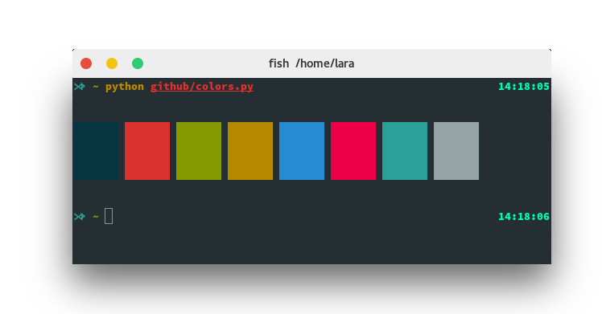
```bash
[[freya]]
  background_color = "#252e32"
  background_image = None
  cursor_color = "#839496"
  foreground_color = "#94a3a5"
  palette = "#073642:#dc322f:#859900:#b58900:#268bd2:#ec0048:#2aa198:#94a3a5:#586e75:#cb4b16:#859900:#b58900:#268bd2:#d33682:#2aa198:#6c71c4"
```
---
## Hemisu Dark
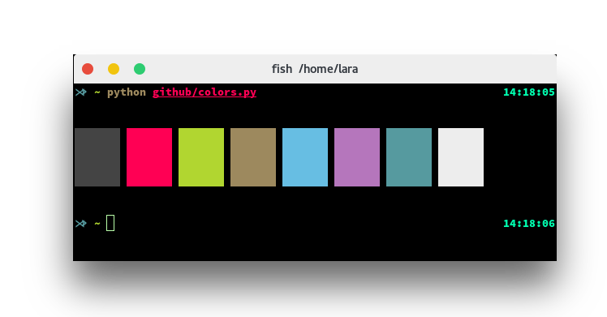
```bash
[[hemisu-dark]]
    background_image = None
    cursor_color = "#BAFFAA"
    foreground_color = "#FFFFFF"
    palette = "#444444:#FF0054:#B1D630:#9D895E:#67BEE3:#B576BC:#569A9F:#EDEDED:#777777:#D65E75:#BAFFAA:#ECE1C8:#9FD3E5:#DEB3DF:#B6E0E5:#FFFFFF"
```
---
## Hemisu Light
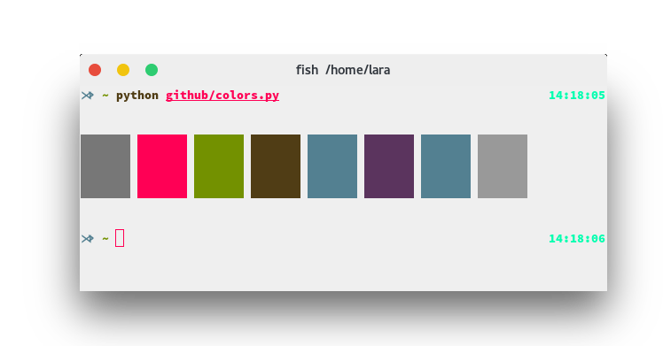
```bash
[[hemisu-light]]
    background_color = "#EFEFEF"
    background_image = None
    cursor_color = "#FF0054"
    foreground_color = "#444444"
    palette = "#777777:#FF0055:#739100:#503D15:#538091:#5B345E:#538091:#999999:#999999:#D65E76:#9CC700:#947555:#9DB3CD:#A184A4:#85B2AA:#BABABA"
```
---
## Hybrid
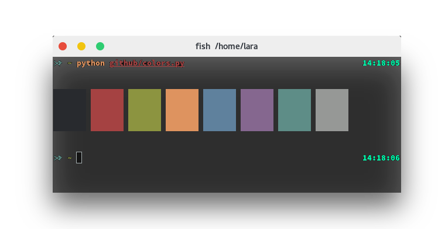
```bash
[[hybrid]]
   background_color = "#141414"
   background_image = None
   cursor_color = "#a6afb0"
   foreground_color = "#94a3a5"
   palette = "#282a2e:#A54242:#8C9440:#de935f:#5F819D:#85678F:#5E8D87:#969896:#373b41:#cc6666:#b5bd68:#f0c674:#81a2be:#b294bb:#8abeb7:#c5c8c6"
```
---
## Jup
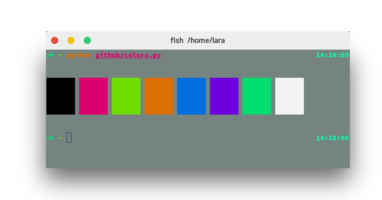
```bash
[[jup]]
    background_color = "#758480"
    background_image = None
    cursor_color = "#23476a"
    foreground_color = "#23476a"
    palette = "#000000:#dd006f:#6fdd00:#dd6f00:#006fdd:#6f00dd:#00dd6f:#f2f2f2:#7d7d7d:#ff74b9:#b9ff74:#ffb974:#74b9ff:#b974ff:#74ffb9:#ffffff"
```
---
## Mar
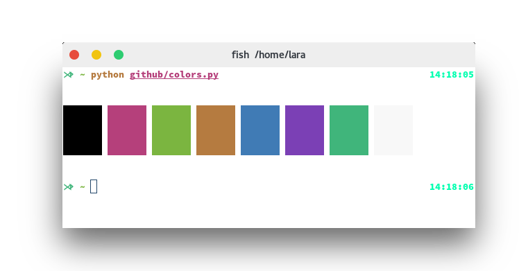
```bash
[[mar]]
    background_color = "#ffffff"
    background_image = None
    cursor_color = "#23476a"
    foreground_color = "#23476a"
    palette = "#000000:#b5407b:#7bb540:#b57b40:#407bb5:#7b40b5:#40b57b:#f8f8f8:#737373:#cd73a0:#a0cd73:#cda073:#73a0cd:#a073cd:#73cda0:#ffffff"
```
---
## Material Colors
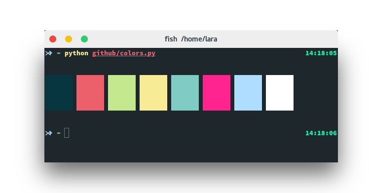
```bash
[[material-colors]]
    background_color = "#1E282C"
    background_image = None
    cursor_color = "#657B83"
    foreground_color = "#C3C7D1"
    palette = "#073641:#EB606B:#C3E88D:#F7EB95:#80CBC3:#FF2490:#AEDDFF:#FFFFFF:#002B36:#EB606B:#C3E88D:#F7EB95:#7DC6BF:#6C71C3:#34434D:#FFFFFF"
```
---
## Miu

```bash
[[miu]]
    background_color = "#0d1926"
    background_image = None
    cursor_color = "#d7dee4"
    foreground_color = "#d9e6f2"
    palette = "#000000:#b87a7a:#7ab87a:#b8b87a:#7a7ab8:#b87ab8:#7ab8b8:#d9d9d9:#262626:#dbbdbd:#bddbbd:#dbdbbd:#bdbddb:#dbbddb:#bddbdb:#ffffff"
```
---
## Monokai Dark
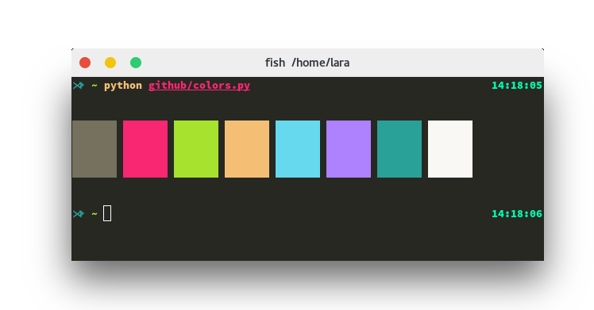
```bash
[[monokai_dark]]
    background_color = "#272822"
    background_image = None
    cursor_color = "#ffffff"
    foreground_color = "#f8f8f2"
    palette = "#75715e:#f92672:#a6e22e:#f4bf75:#66d9ef:#ae81ff:#2aa198:#f9f8f5:#272822:#f92672:#a6e22e:#f4bf75:#66d9ef:#ae81ff:#2aa198:#f9f8f5"
```
---
## Nep
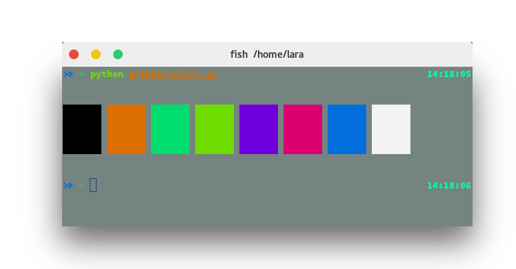
```bash
[[nep]]
    background_color = "#758480"
    background_image = None
    cursor_color = "#23476a"
    foreground_color = "#23476a"
    palette = "#000000:#dd6f00:#00dd6f:#6fdd00:#6f00dd:#dd006f:#006fdd:#f2f2f2:#7d7d7d:#ffb974:#74ffb9:#b9ff74:#b974ff:#ff74b9:#74b9ff:#ffffff"
```
---
## Ocean Dark
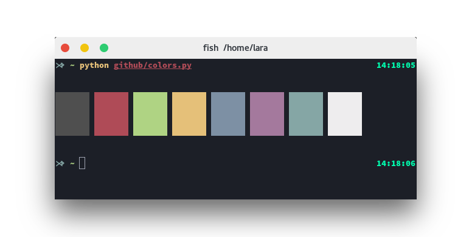
```bash
[[ocean-dark]]
    background_color = "#1c1f27"
    background_image = None
    cursor_color = "#a0a4b2"
    foreground_color = "#979cac"
    palette = "#4F4F4F:#AF4B57:#AFD383:#E5C079:#7D90A4:#A4799D:#85A6A5:#EEEDEE:#7B7B7B:#AF4B57:#CEFFAB:#FFFECC:#B5DCFE:#FB9BFE:#DFDFFD:#FEFFFE"
```
---
## One Dark

```bash
[[one-dark]]
    background_color = "#1e2127"
    background_image = None
    cursor_color = "#676c76"
    foreground_color = "#5c6370"
    palette = "#000000:#e06c75:#98c379:#d19a66:#61afef:#c678dd:#56b6c2:#abb2bf:#5c6370:#e06c75:#98c379:#d19a66:#61afef:#c678dd:#56b6c2:#fffefe"
```
---
## One Light
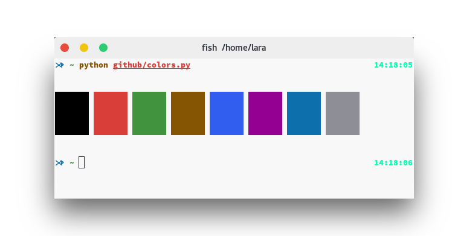
```bash
[[one-light]]
    background_color = "#f8f8f8"
    background_image = None
    cursor_color = "#2A2B32"
    foreground_color = "#2a2b32"
    palette = "#000000:#DA3E39:#41933E:#855504:#315EEE:#930092:#0E6FAD:#8E8F96:#2A2B32:#DA3E39:#41933E:#855504:#315EEE:#930092:#0E6FAD:#FFFEFE"
```
---
## Pali
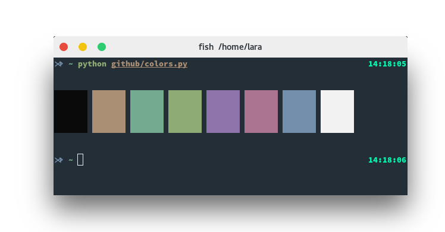
```bash
[[pali]]
    background_color = "#232e37"
    background_image = None
    cursor_color = "#e3ecf5"
    foreground_color = "#d9e6f2"
    palette = "#0a0a0a:#ab8f74:#74ab8f:#8fab74:#8f74ab:#ab748f:#748fab:#f2f2f2:#5d5d5d:#ff1d62:#9cc3af:#ffd00a:#af9cc3:#ff1d62:#4bb8fd:#a020f0"
```
---
## Peppermint
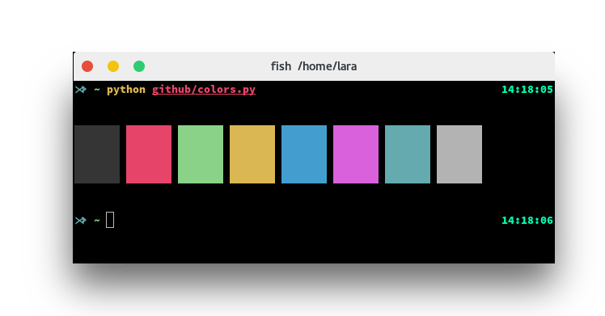
```bash
[[peppermint]]
    background_image = None
    cursor_color = "#BBBBBB"
    foreground_color = "#c7c7c7"
    palette = "#353535:#E64569:#89D287:#DAB752:#439ECF:#D961DC:#64AAAF:#B3B3B3:#535353:#E4859A:#A2CCA1:#E1E387:#6FBBE2:#E586E7:#96DCDA:#DEDEDE"
```
---
## Sat
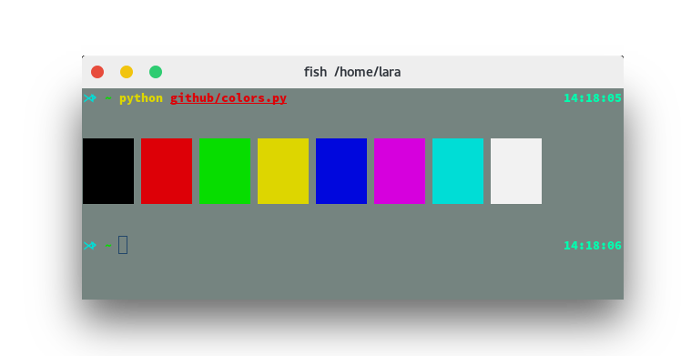
```bash
[[sat]]
    background_color = "#758480"
    background_image = None
    cursor_color = "#23476a"
    foreground_color = "#23476a"
    palette = "#000000:#dd0007:#07dd00:#ddd600:#0007dd:#d600dd:#00ddd6:#f2f2f2:#7d7d7d:#ff7478:#78ff74:#fffa74:#7478ff:#fa74ff:#74fffa:#ffffff"
```
---
## Shel
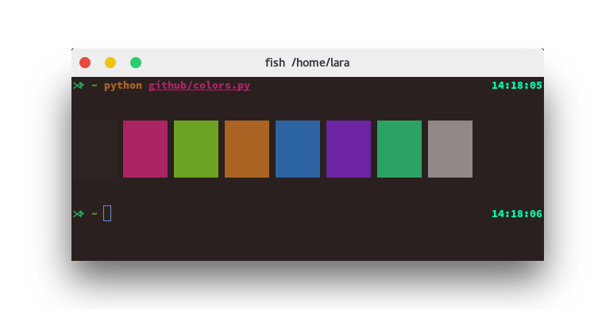
```bash
[[shel]]
   background_color = "#2a201f"
   background_image = None
   cursor_color = "#6192d2"
   foreground_color = "#4882cd"
   palette = "#2c2423:#ab2463:#6ca323:#ab6423:#2c64a2:#6c24a2:#2ca363:#918988:#918988:#f588b9:#c2ee86:#f5ba86:#8fbaec:#c288ec:#8feeb9:#f5eeec"
```
---
## Smyck
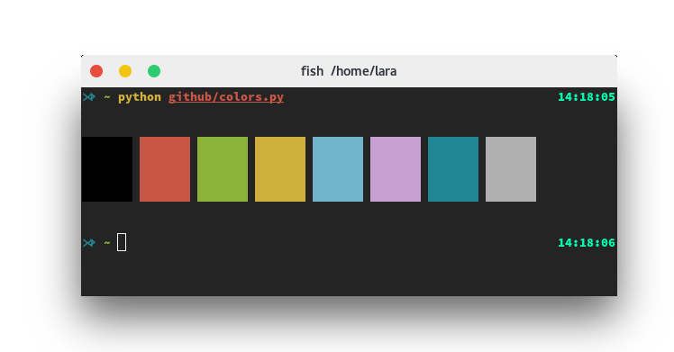
```bash
[[smyck]]
  background_color = "#242424"
  background_image = None
  cursor_color = "#f8f6f6"
  foreground_color = "#f7f7f7"
  palette = "#000000:#C75646:#8EB33B:#D0B03C:#72B3CC:#C8A0D1:#218693:#B0B0B0:#5D5D5D:#E09690:#CDEE69:#FFE377:#9CD9F0:#FBB1F9:#77DFD8:#F7F7F7"
 ```
---
## Solorized Dark
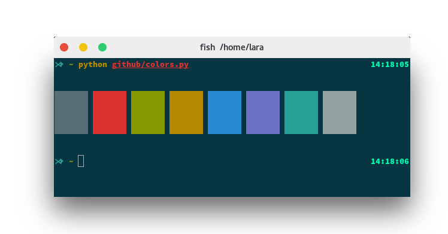
```bash
[[solorized-dark]]
    background_color = "#073642"
    background_image = None
    cursor_color = "#a9b5b5"
    foreground_color = "#93a1a1"
    palette = "#586e75:#dc322f:#859900:#b58900:#268bd2:#6c71c4:#2aa198:#93a1a1:#002b36:#d70000:#5f8700:#af8700:#0087ff:#5f5faf:#00afaf:#8a8a8a"
 ```
---
## Solorized Light
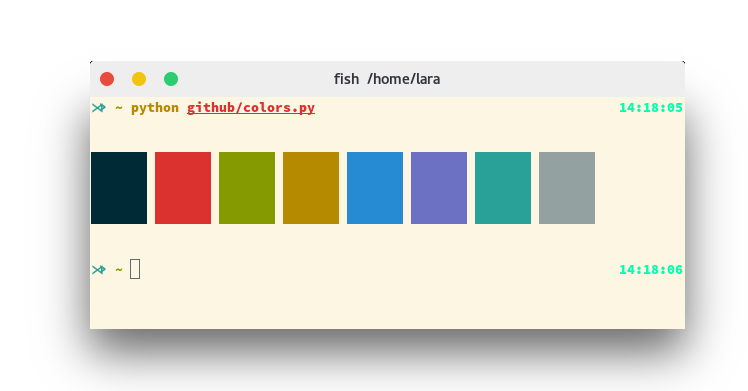
```bash
[[solorized-light]]
    background_color = "#fdf6e3"
    background_image = None
    cursor_color = "#586e75"
    foreground_color = "#586e75"
    palette = "#002b36:#dc322f:#859900:#b58900:#268bd2:#6c71c4:#2aa198:#93a1a1:#1c1c1c:#d70000:#5f8700:#af8700:#0087ff:#5f5faf:#00afaf:#8a8a8a"
 ```
---
## Tin
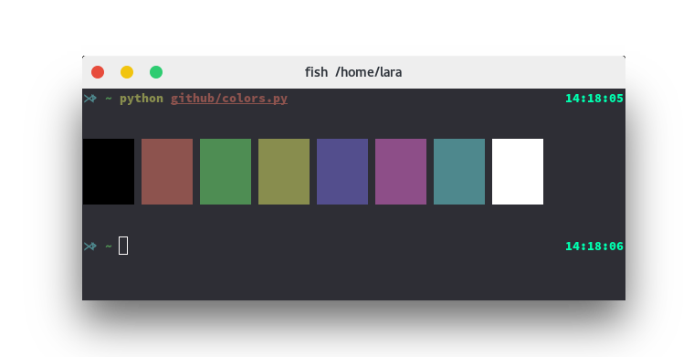
```bash
 [[tin]]
    background_color = "#2e2e35"
    background_image = None
    cursor_color = "#fdfafa"
    foreground_color = "#ffffff"
    palette = "#000000:#8d534e:#4e8d53:#888d4e:#534e8d:#8d4e88:#4e888d:#ffffff:#000000:#b57d78:#78b57d:#b0b578:#7d78b5:#b578b0:#78b0b5:#ffffff"
 ```
---
## Tomorrow
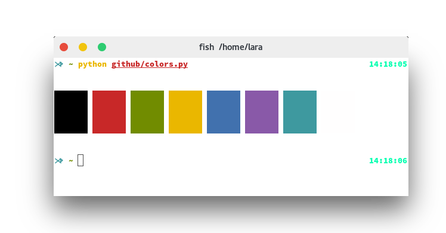
```bash
 [[tomorrow]]
    background_color = "#FFFFFF"
    background_image = None
    cursor_color = "#4C4C4C"
    foreground_color = "#4D4D4C"
    palette = "#000000:#C82828:#718C00:#EAB700:#4171AE:#8959A8:#3E999F:#FFFEFE:#000000:#C82828:#708B00:#E9B600:#4170AE:#8958A7:#3D999F:#FFFEFE"
 ```
---
## Tomorrow Night
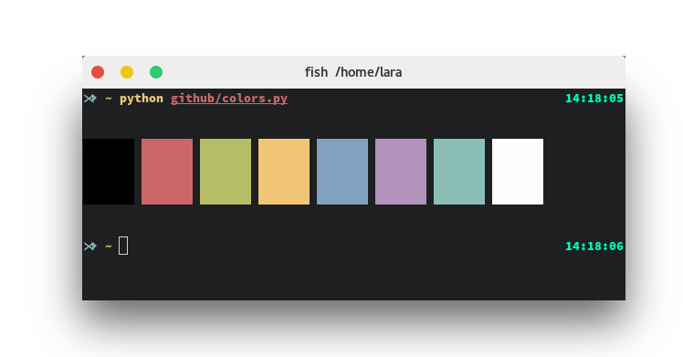
```bash
 [[tomorrow-night]]
    background_color = "#1d1f21"
    background_image = None
    cursor_color = "#d2d4d2"
    foreground_color = "#c5c8c6"
    palette = "#000000:#CC6666:#B5BD68:#F0C674:#81A2BE:#B293BB:#8ABEB7:#FFFEFE:#000000:#CC6666:#B5BD68:#F0C574:#80A1BD:#B294BA:#8ABDB6:#FFFEFE"
 ```
---
## Tomorrow Night Blue
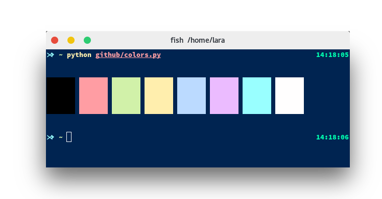
```bash
 [[tomorrow-night-blue]]
    background_color = "#002451"
    background_image = None
    cursor_color = "#ffffff"
    foreground_color = "#fffefe"
    palette = "#000000:#FF9DA3:#D1F1A9:#FFEEAD:#BBDAFF:#EBBBFF:#99FFFF:#FFFEFE:#000000:#FF9CA3:#D0F0A8:#FFEDAC:#BADAFF:#EBBAFF:#99FFFF:#FFFEFE"
 ```
---

## Tomorrow Night Eighties
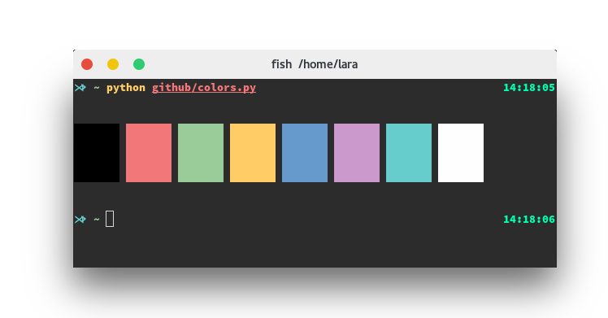
```bash
  [[tomorrow-night-eighties]]
    background_color = "#2c2c2c"
    background_image = None
    cursor_color = "#d8d8d8"
    foreground_color = "#cccccc"
    palette = "#000000:#F27779:#99CC99:#FFCC66:#6699CC:#CC99CC:#66CCCC:#FFFEFE:#000000:#F17779:#99CC99:#FFCC66:#6699CC:#CC99CC:#66CCCC:#FFFEFE"
 ```
---
## Ura
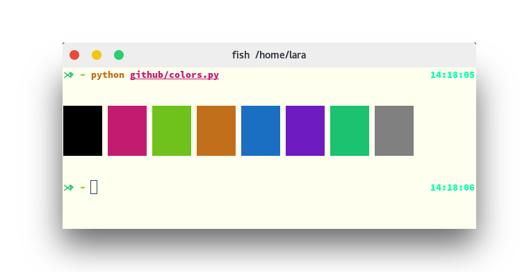
```bash
  [[ura]]
    background_color = "#feffee"
    background_image = None
    cursor_color = "#23476a"
    foreground_color = "#23476a"
    palette = "#000000:#c21b6f:#6fc21b:#c26f1b:#1b6fc2:#6f1bc2:#1bc26f:#808080:#808080:#ee84b9:#b9ee84:#eeb984:#84b9ee:#b984ee:#84eeb9:#e5e5e5"
 ```
---
## Vag
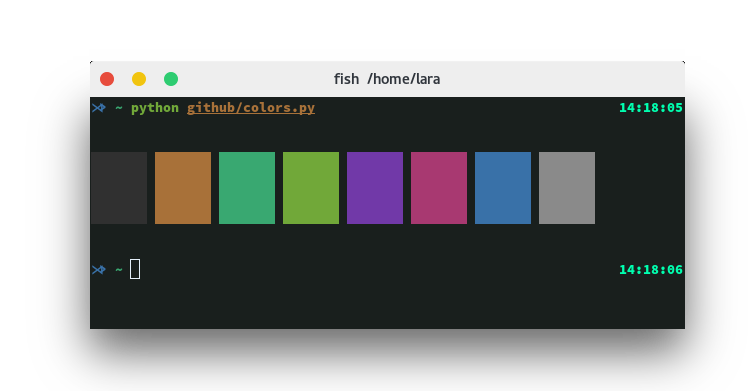
```bash
  [[vag]]
    background_color = "#191f1d"
    background_image = None
    cursor_color = "#e5f0fa"
    foreground_color = "#d9e6f2"
    palette = "#303030:#a87139:#39a871:#71a839:#7139a8:#a83971:#3971a8:#8a8a8a:#494949:#b0763b:#3bb076:#76b03b:#763bb0:#b03b76:#3b76b0:#cfcfcf"
 ```


[⬆ Back to top](#contents)