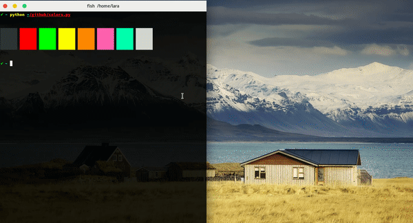

# Terminator themes
> The biggest collection of [Terminator](http://www.tenshu.net/terminator/) themes in a plugin.



## Installation

**1. Install the [requests](https://github.com/requests/requests) python package**

```sh
 pip install requests
```
**2. Create plugins directory if it does not exist**

```sh
 mkdir -p $HOME/.config/terminator/plugins
```

**3. Getting the correct plugin**

For terminator >= 1.9

```sh
 wget https://git.io/v5Zww -O $HOME"/.config/terminator/plugins/terminator-themes.py"
```

For terminator < 1.9

```sh
 wget https://git.io/v5Zwz -O $HOME"/.config/terminator/plugins/terminator-themes.py"
```

**4. Activation**

Check the `TerminatorThemes` option under `terminator > preferences > plugins`.
Preferences can be accessed by right clicking inside the terminator window.


## Usage

* Open the terminator context menu and select `Themes`.
* Select you favorite theme and click `install` (you can [preview available themes](themes.md) before installing).
* Enjoy! :smiley:
