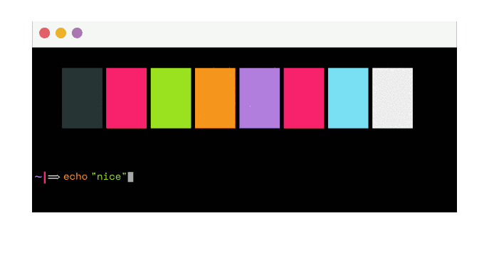
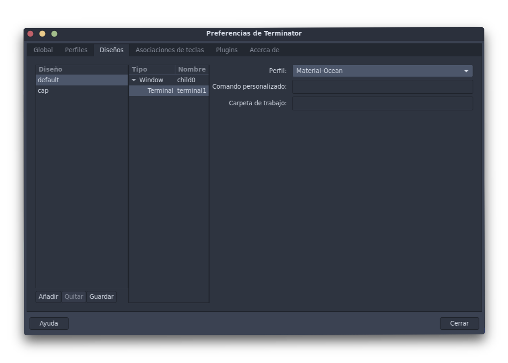
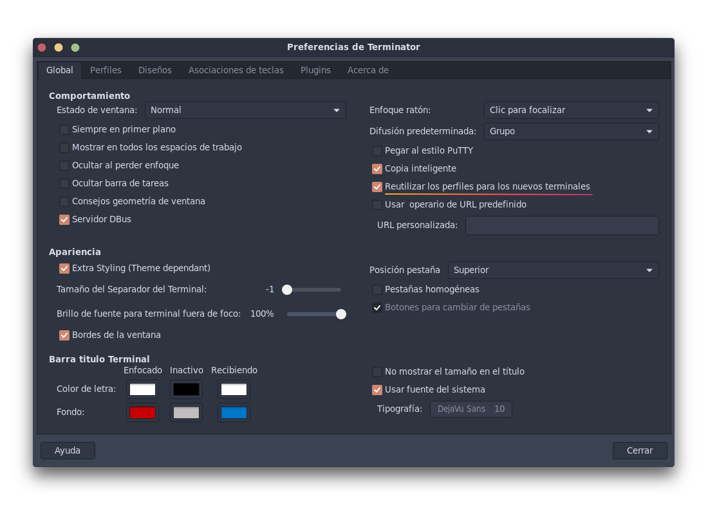

<!-- Logo -->

<div align="center">


The biggest collection of themes for [Terminator](https://launchpad.net/terminator) in a plugin.



</div>

## Installation (network-based)

**1. Install the [requests](https://github.com/requests/requests) python package**

```sh
 pip install requests
```
> **Note:** If you're using python 3, ignore the previous command and install the `python2-requests` package for your specific OS.

**2. Create plugins directory if it does not exist**

```sh
 mkdir -p $HOME/.config/terminator/plugins

- to install the repository version, skipping step 3 - 

./install-remote.sh
```

**3. Getting the correct plugin**

For terminator >= 1.9

```sh
 wget https://git.io/v5Zww -O $HOME"/.config/terminator/plugins/terminator-themes.py"
```

For terminator < 1.9

```sh
 wget https://git.io/v5Zwz -O $HOME"/.config/terminator/plugins/terminator-themes.py"
```

**4. Activation**

Check the `TerminatorThemes` option under `terminator > preferences > plugins`.

## Installation (locally-based)
(This was tested using Terminator 1.92-2 community)

(Since this uses the local JSON file the Python requests package is not required)

**1. Run the install-local.sh script**
```bash
$ ./install-local.sh
```

**2. Activation**

Check the `TerminatorThemesLocal` option under `terminator > preferences > plugins`.

## Uninstallation
(This was tested using Terminator 1.92-2 community)

**1. Run the uninstall-local.sh script**
```bash
$ ./uninstall-local.sh

- for the remote version -

$ ./uninstall-remote.sh
```

## Usage

* Open the terminator context menu and select `Themes`.
* Select you favorite theme and click `install` (you can [preview available themes](themes.md) before installing).
* Enjoy! :smiley:


## Setting a Default

There are two ways to set a chosen theme as a default:

**Option One: Edit Terminator Config Manually**

Once you install a theme it's stored in Preferences > Profiles. To change an installed theme to the default one open `~/.config/terminator/config` and replace the `[[default]]` theme with your preferred theme under the `[profiles]` setting. (thanks @jacsmith21)

**Option Two: Use the GUI**

If you do not want to deal with the modification of the configuration file, you can do the following:

1. Go to `Preferences`
2. Choose the `Layouts` tab.
3. Choose your preferred layout.
4. Choose the layout terminal (in the next column).
5. Choose you preferred profile.



Additionally in order to reuse your new selected profile in the new terminals (avoid selecting the profile in each split) open `preferences > global` and check the `'Re-use profiles for new terminals'` option.

