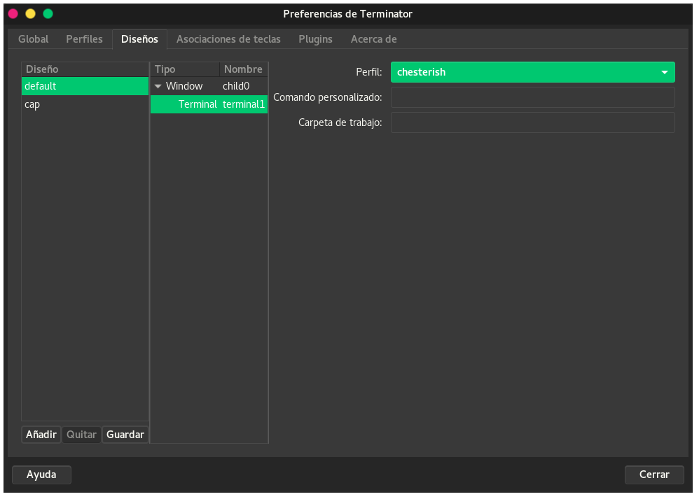

# Terminator themes
> The biggest collection of [Terminator](http://www.tenshu.net/terminator/) themes in a plugin.


## Installation

**1. Install the [requests](https://github.com/requests/requests) python package**

```sh
 pip install requests
```
**2. Create plugins directory if it does not exist**

```sh
 mkdir -p $HOME/.config/terminator/plugins
```

**3. Getting the correct plugin**

For terminator >= 1.9

```sh
 wget https://git.io/v5Zww -O $HOME"/.config/terminator/plugins/terminator-themes.py"
```

For terminator < 1.9

```sh
 wget https://git.io/v5Zwz -O $HOME"/.config/terminator/plugins/terminator-themes.py"
```

**4. Activation**

Check the `TerminatorThemes` option under `terminator > preferences > plugins`.


## Usage

* Open the terminator context menu and select `Themes`.
* Select you favorite theme and click `install` (you can [preview available themes](themes.md) before installing).
* Enjoy! :smiley:

### Setting a Default

There are two ways to set a chosen theme as a default:

**Option One: Edit Terminator Config Manually**

Once you install a theme it's stored in Preferences > Profiles. To change an installed theme to the default one open `~/.config/terminator/config` and replace the `[[default]]` theme with your preferred theme under the `[profiles]` setting. (thanks @jacsmith21)

**Option Two: Use the GUI**

If you do not want to deal with the modification of the configuration file, you can do the following:

1. Go to `Preferences`
2. Choose the `Layouts` tab.
3. Choose your preferred layout.
4. Choose the layout terminal (in the next column).
5. Choose you preferred profile.


