# Terminator themes
> The biggest collection of [Terminator](http://www.tenshu.net/terminator/) themes.

# Contents

- [Usage](#usage)
- [Themes](#themes)


# Usage:

- Just download your favorite theme and paste it on your terminator config file (~/.config/terminator/config) in the profiles section.
- Restart terminator and choose the profile.


If the terminator config directory does not exist create it by doing the following:

```bash
$ mkdir -p ~/.config/terminator/
$ touch ~/.config/terminator/config
```
The basic structure of config file is:
```bash
[global_config]
[keybindings]
[layouts]
  [[default]]
    [[[child1]]]
      parent = window0
      type = Terminal
    [[[window0]]]
      parent = ""
      type = Window
[plugins]
[profiles]
  [[default]]

```


[⬆ Back to top](#contents)

# Themes

 
**3024 day**  [Download](https://raw.githubusercontent.com/EliverLara/terminator-themes/master/schemes/3024%20Day.config)  | **3024 night**  [Download](https://raw.githubusercontent.com/EliverLara/terminator-themes/master/schemes/3024%20Night.config)
:---------------------------------------------:|:----------------------------------------------:  
**Aci**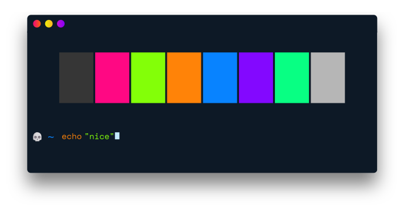  [Download](https://raw.githubusercontent.com/EliverLara/terminator-themes/master/schemes/Aci.config)  | **Aco**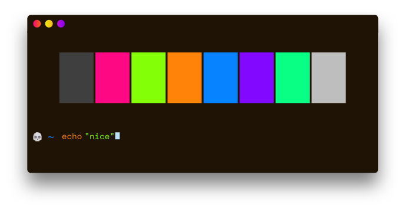  [Download](https://raw.githubusercontent.com/EliverLara/terminator-themes/master/schemes/Aco.config)  
**Adventuretime**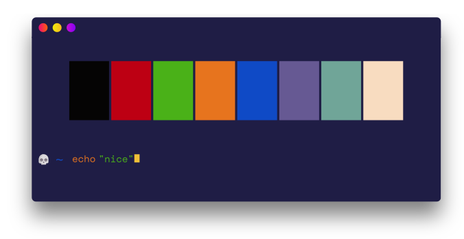  [Download](https://raw.githubusercontent.com/EliverLara/terminator-themes/master/schemes/AdventureTime.config)  | **Afterglow**  [Download](https://raw.githubusercontent.com/EliverLara/terminator-themes/master/schemes/Afterglow.config)  
**Alienblood**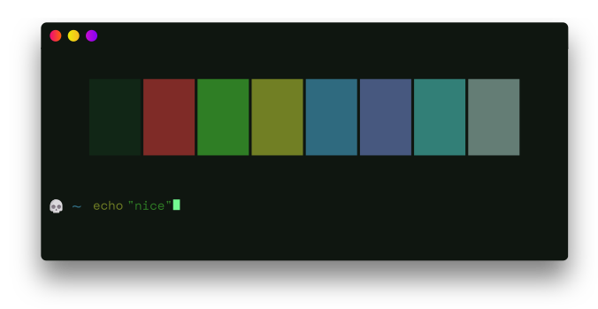  [Download](https://raw.githubusercontent.com/EliverLara/terminator-themes/master/schemes/AlienBlood.config)  | **Argonaut**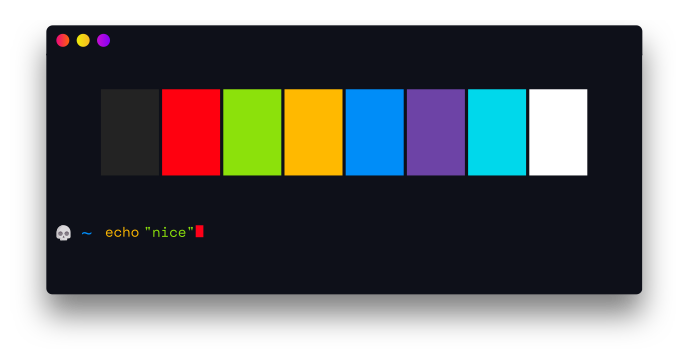  [Download](https://raw.githubusercontent.com/EliverLara/terminator-themes/master/schemes/Argonaut.config)  
**Arthur**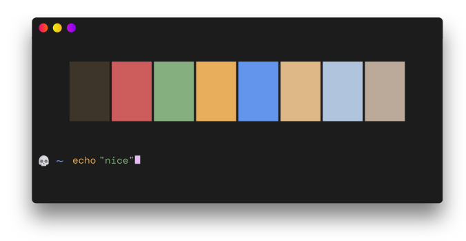  [Download](https://raw.githubusercontent.com/EliverLara/terminator-themes/master/schemes/Arthur.config)  | **Ateliersulphurpool**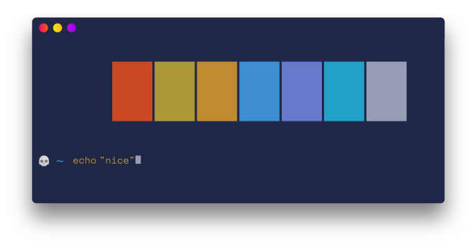  [Download](https://raw.githubusercontent.com/EliverLara/terminator-themes/master/schemes/AtelierSulphurpool.config)  
**Atom**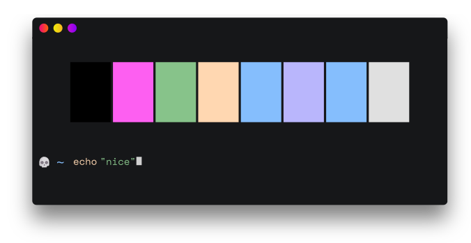  [Download](https://raw.githubusercontent.com/EliverLara/terminator-themes/master/schemes/Atom.config)  | **Atomonelight**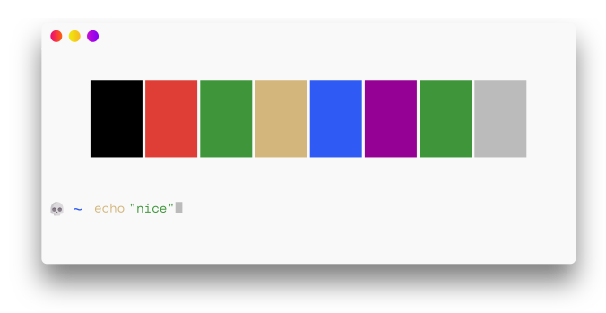  [Download](https://raw.githubusercontent.com/EliverLara/terminator-themes/master/schemes/AtomOneLight.config)  
**Azu**  [Download](https://raw.githubusercontent.com/EliverLara/terminator-themes/master/schemes/Azu.config)  | **Ayu**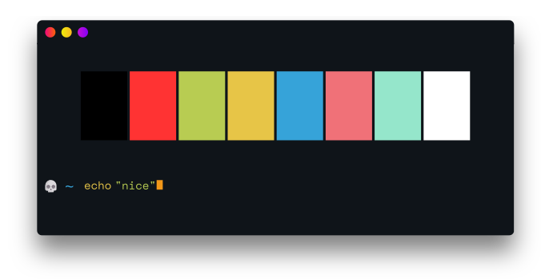  [Download](https://raw.githubusercontent.com/EliverLara/terminator-themes/master/schemes/ayu.config)  
**Ayu_light**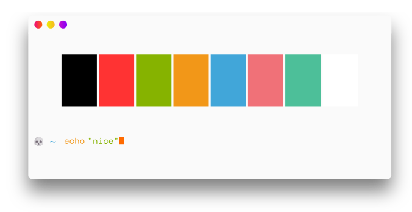  [Download](https://raw.githubusercontent.com/EliverLara/terminator-themes/master/schemes/ayu_light.config)  | **Ayu mirage**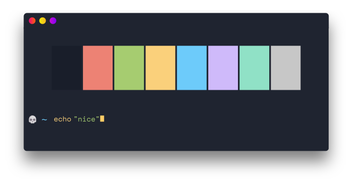  [Download](https://raw.githubusercontent.com/EliverLara/terminator-themes/master/schemes/Ayu%20mirage.config)  
**Batman**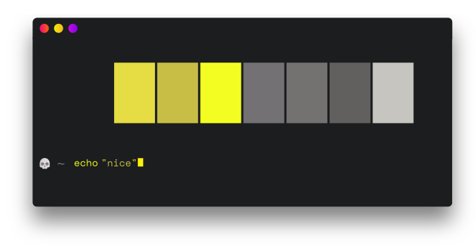  [Download](https://raw.githubusercontent.com/EliverLara/terminator-themes/master/schemes/Batman.config)  | **Belafonte day**  [Download](https://raw.githubusercontent.com/EliverLara/terminator-themes/master/schemes/Belafonte%20Day.config)  
**Belafonte night**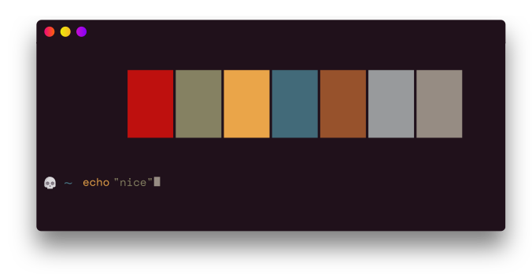  [Download](https://raw.githubusercontent.com/EliverLara/terminator-themes/master/schemes/Belafonte%20Night.config)  | **Bim**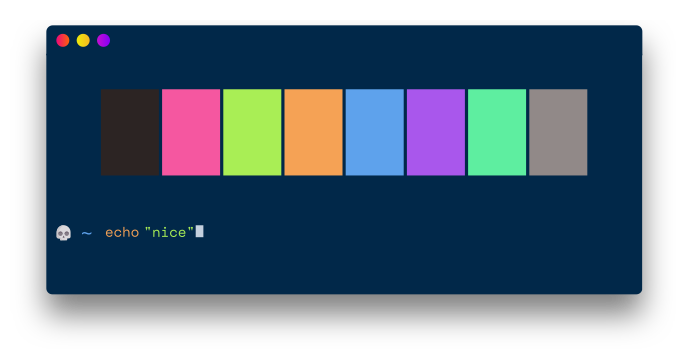  [Download](https://raw.githubusercontent.com/EliverLara/terminator-themes/master/schemes/Bim.config)  
**Birdsofparadise**  [Download](https://raw.githubusercontent.com/EliverLara/terminator-themes/master/schemes/BirdsOfParadise.config)  | **Blazer**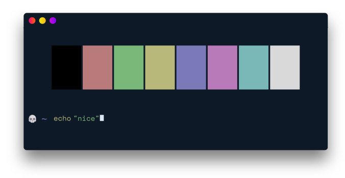  [Download](https://raw.githubusercontent.com/EliverLara/terminator-themes/master/schemes/Blazer.config)  
**Bloody**  [Download](https://raw.githubusercontent.com/EliverLara/terminator-themes/master/schemes/Bloody.config)  | **Borland**  [Download](https://raw.githubusercontent.com/EliverLara/terminator-themes/master/schemes/Borland.config)  
**Bright lights**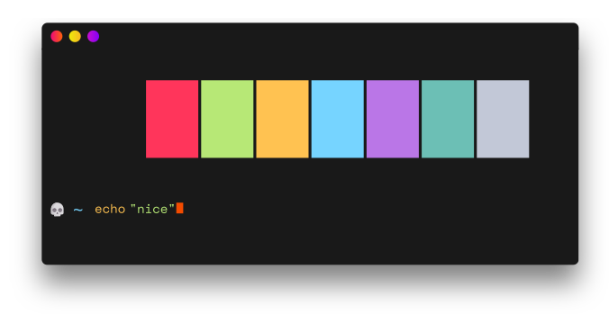  [Download](https://raw.githubusercontent.com/EliverLara/terminator-themes/master/schemes/Bright%20Lights.config)  | **Broadcast**  [Download](https://raw.githubusercontent.com/EliverLara/terminator-themes/master/schemes/Broadcast.config)  
**Brogrammer**  [Download](https://raw.githubusercontent.com/EliverLara/terminator-themes/master/schemes/Brogrammer.config)  | **C64**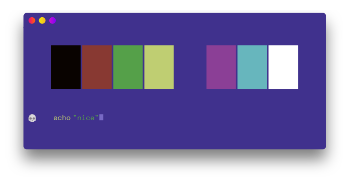  [Download](https://raw.githubusercontent.com/EliverLara/terminator-themes/master/schemes/C64.config)  
**Cai**  [Download](https://raw.githubusercontent.com/EliverLara/terminator-themes/master/schemes/Cai.config)  | **Chalkboard**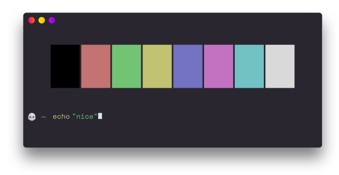  [Download](https://raw.githubusercontent.com/EliverLara/terminator-themes/master/schemes/Chalkboard.config)  
**Chalk**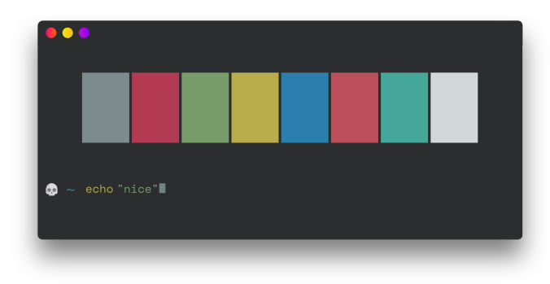  [Download](https://raw.githubusercontent.com/EliverLara/terminator-themes/master/schemes/Chalk.config)  | **Chesterish**  [Download](https://raw.githubusercontent.com/EliverLara/terminator-themes/master/schemes/Chesterish.config)  
**Ciapre**  [Download](https://raw.githubusercontent.com/EliverLara/terminator-themes/master/schemes/Ciapre.config)  | **Clrs**  [Download](https://raw.githubusercontent.com/EliverLara/terminator-themes/master/schemes/CLRS.config)  
**Cobalt2**  [Download](https://raw.githubusercontent.com/EliverLara/terminator-themes/master/schemes/Cobalt2.config)  | **Cobalt neon**  [Download](https://raw.githubusercontent.com/EliverLara/terminator-themes/master/schemes/Cobalt%20Neon.config)  
**Crayonponyfish**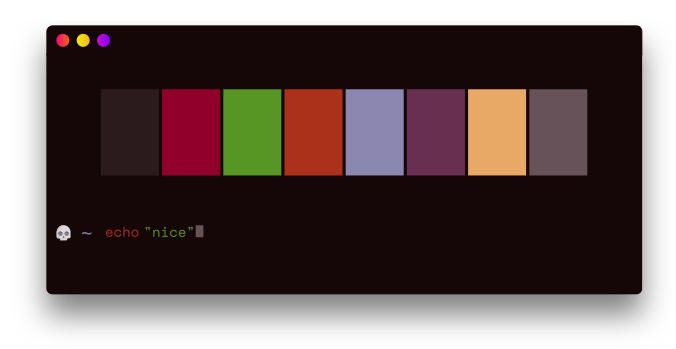  [Download](https://raw.githubusercontent.com/EliverLara/terminator-themes/master/schemes/CrayonPonyFish.config)  | **Dark pastel**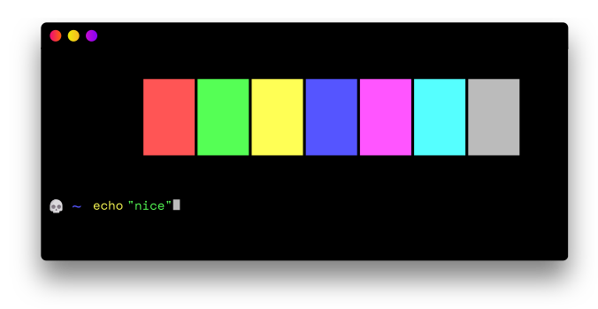  [Download](https://raw.githubusercontent.com/EliverLara/terminator-themes/master/schemes/Dark%20Pastel.config)  
**Darkside**  [Download](https://raw.githubusercontent.com/EliverLara/terminator-themes/master/schemes/Darkside.config)  | **Deep**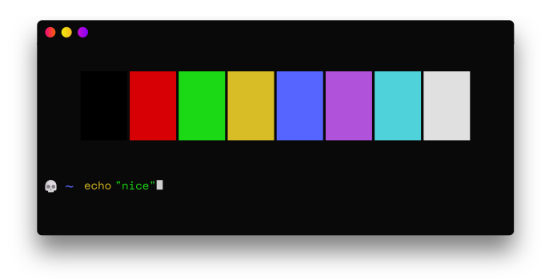  [Download](https://raw.githubusercontent.com/EliverLara/terminator-themes/master/schemes/deep.config)  
**Desert**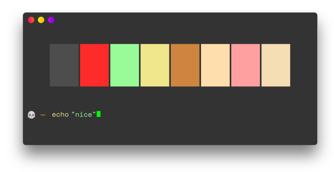  [Download](https://raw.githubusercontent.com/EliverLara/terminator-themes/master/schemes/Desert.config)  | **Dimmedmonokai**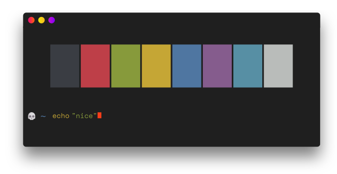  [Download](https://raw.githubusercontent.com/EliverLara/terminator-themes/master/schemes/DimmedMonokai.config)  
**Dotgov**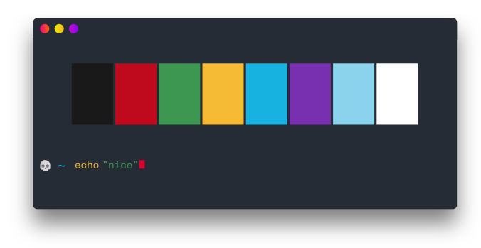  [Download](https://raw.githubusercontent.com/EliverLara/terminator-themes/master/schemes/DotGov.config)  | **Dracula**  [Download](https://raw.githubusercontent.com/EliverLara/terminator-themes/master/schemes/Dracula.config)  
**Duotone dark**  [Download](https://raw.githubusercontent.com/EliverLara/terminator-themes/master/schemes/Duotone%20Dark.config)  | **Earthsong**  [Download](https://raw.githubusercontent.com/EliverLara/terminator-themes/master/schemes/Earthsong.config)  
**Elemental**  [Download](https://raw.githubusercontent.com/EliverLara/terminator-themes/master/schemes/Elemental.config)  | **Elementary**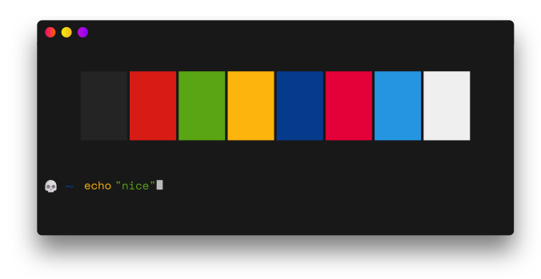  [Download](https://raw.githubusercontent.com/EliverLara/terminator-themes/master/schemes/Elementary.config)  
**Elio**  [Download](https://raw.githubusercontent.com/EliverLara/terminator-themes/master/schemes/Elio.config)  | **Encom**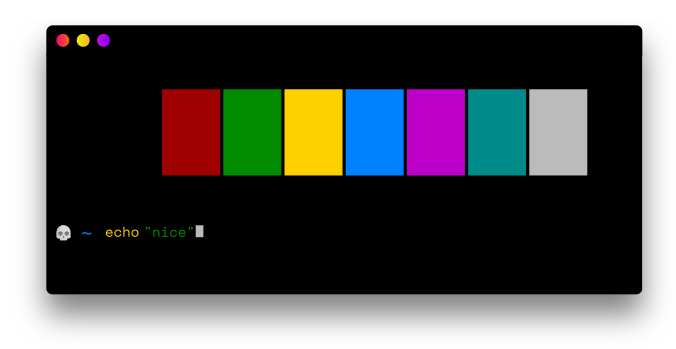  [Download](https://raw.githubusercontent.com/EliverLara/terminator-themes/master/schemes/ENCOM.config)  
**Espresso**  [Download](https://raw.githubusercontent.com/EliverLara/terminator-themes/master/schemes/Espresso.config)  | **Espresso libre**  [Download](https://raw.githubusercontent.com/EliverLara/terminator-themes/master/schemes/Espresso%20Libre.config)  
**Fideloper**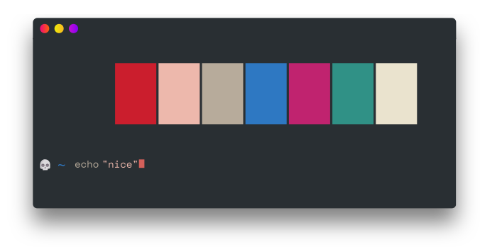  [Download](https://raw.githubusercontent.com/EliverLara/terminator-themes/master/schemes/Fideloper.config)  | **Firefoxdev**  [Download](https://raw.githubusercontent.com/EliverLara/terminator-themes/master/schemes/FirefoxDev.config)  
**Firewatch**  [Download](https://raw.githubusercontent.com/EliverLara/terminator-themes/master/schemes/Firewatch.config)  | **Fishtank**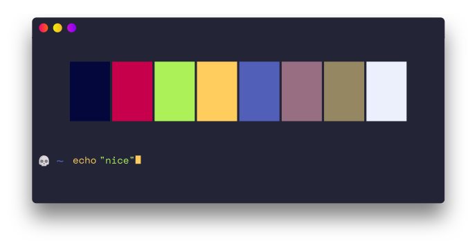  [Download](https://raw.githubusercontent.com/EliverLara/terminator-themes/master/schemes/FishTank.config)  
**Flat**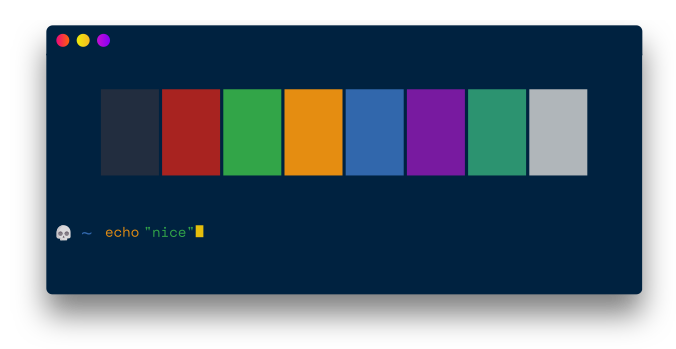  [Download](https://raw.githubusercontent.com/EliverLara/terminator-themes/master/schemes/Flat.config)  | **Flatland**  [Download](https://raw.githubusercontent.com/EliverLara/terminator-themes/master/schemes/Flatland.config)  
**Floraverse**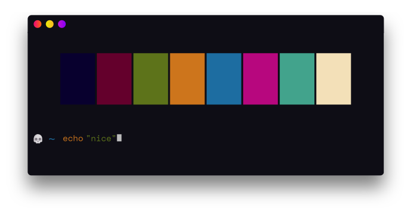  [Download](https://raw.githubusercontent.com/EliverLara/terminator-themes/master/schemes/Floraverse.config)  | **Forestblue**  [Download](https://raw.githubusercontent.com/EliverLara/terminator-themes/master/schemes/ForestBlue.config)  
**Freya**  [Download](https://raw.githubusercontent.com/EliverLara/terminator-themes/master/schemes/Freya.config)  | **Frontenddelight**  [Download](https://raw.githubusercontent.com/EliverLara/terminator-themes/master/schemes/FrontEndDelight.config)  
**Funforrest**  [Download](https://raw.githubusercontent.com/EliverLara/terminator-themes/master/schemes/FunForrest.config)  | **Galaxy**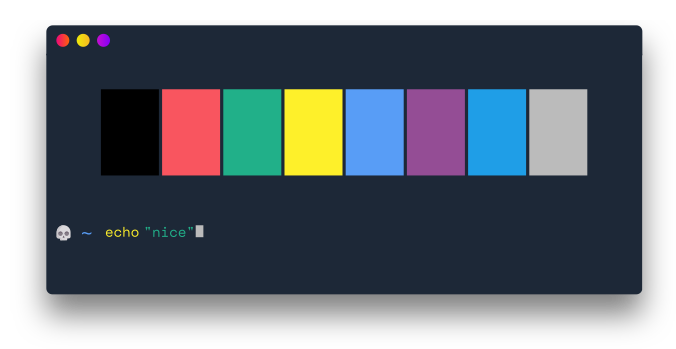  [Download](https://raw.githubusercontent.com/EliverLara/terminator-themes/master/schemes/Galaxy.config)  
**Github**  [Download](https://raw.githubusercontent.com/EliverLara/terminator-themes/master/schemes/Github.config)  | **Glacier**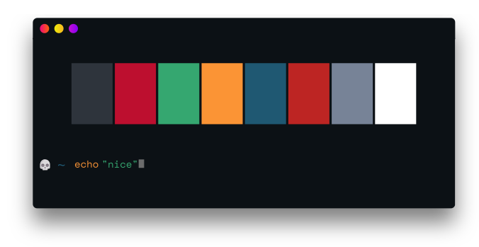  [Download](https://raw.githubusercontent.com/EliverLara/terminator-themes/master/schemes/Glacier.config)  
**Grape**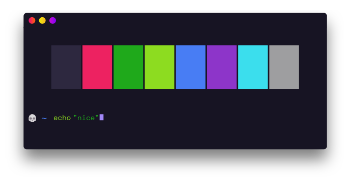  [Download](https://raw.githubusercontent.com/EliverLara/terminator-themes/master/schemes/Grape.config)  | **Grass**  [Download](https://raw.githubusercontent.com/EliverLara/terminator-themes/master/schemes/Grass.config)  
**Gruvbox dark**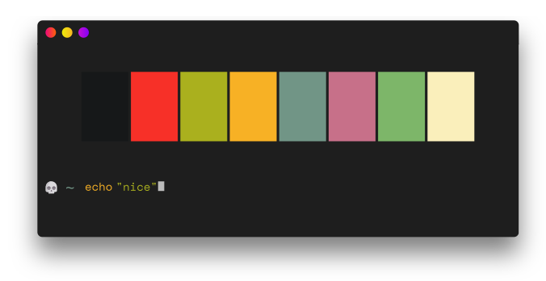  [Download](https://raw.githubusercontent.com/EliverLara/terminator-themes/master/schemes/Gruvbox%20Dark.config)  | **Hardcore**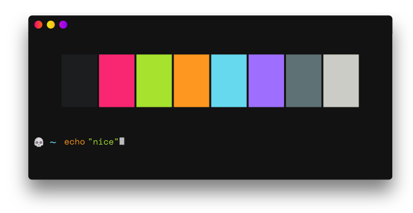  [Download](https://raw.githubusercontent.com/EliverLara/terminator-themes/master/schemes/Hardcore.config)  
**Harper**  [Download](https://raw.githubusercontent.com/EliverLara/terminator-themes/master/schemes/Harper.config)  | **Hemisu dark**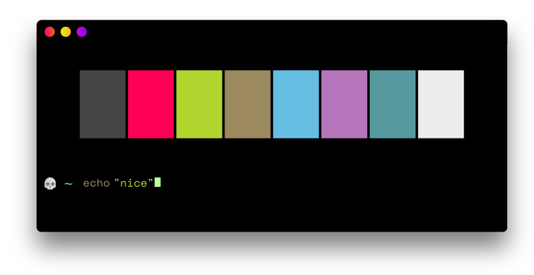  [Download](https://raw.githubusercontent.com/EliverLara/terminator-themes/master/schemes/Hemisu%20dark.config)  
**Hemisu light**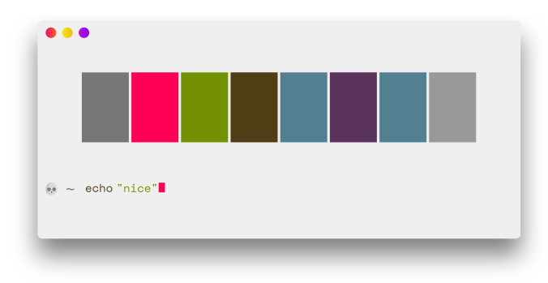  [Download](https://raw.githubusercontent.com/EliverLara/terminator-themes/master/schemes/Hemisu%20light.config)  | **Highway**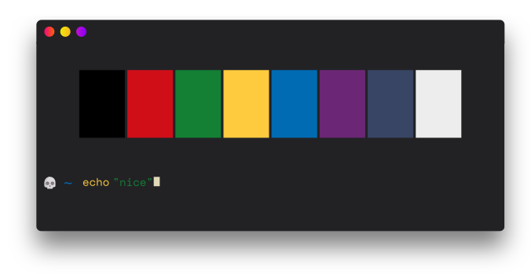  [Download](https://raw.githubusercontent.com/EliverLara/terminator-themes/master/schemes/Highway.config)  
**Hipster green**  [Download](https://raw.githubusercontent.com/EliverLara/terminator-themes/master/schemes/Hipster%20Green.config)  | **Homebrew**  [Download](https://raw.githubusercontent.com/EliverLara/terminator-themes/master/schemes/Homebrew.config)  
**Hurtado**  [Download](https://raw.githubusercontent.com/EliverLara/terminator-themes/master/schemes/Hurtado.config)  | **Hybrid**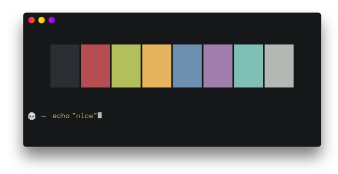  [Download](https://raw.githubusercontent.com/EliverLara/terminator-themes/master/schemes/Hybrid.config)  
**Ic_green_ppl**  [Download](https://raw.githubusercontent.com/EliverLara/terminator-themes/master/schemes/IC_Green_PPL.config)  | **Ic_orange_ppl**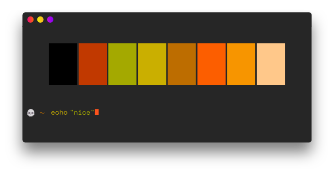  [Download](https://raw.githubusercontent.com/EliverLara/terminator-themes/master/schemes/IC_Orange_PPL.config)  
**Idletoes**  [Download](https://raw.githubusercontent.com/EliverLara/terminator-themes/master/schemes/idleToes.config)  | **Ir_black**  [Download](https://raw.githubusercontent.com/EliverLara/terminator-themes/master/schemes/IR_Black.config)  
**Jackie brown**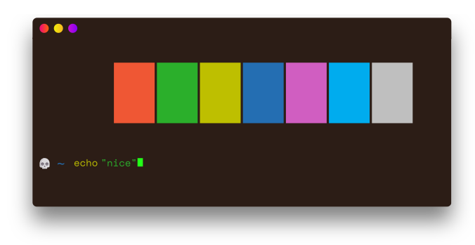  [Download](https://raw.githubusercontent.com/EliverLara/terminator-themes/master/schemes/Jackie%20Brown.config)  | **Japanesque**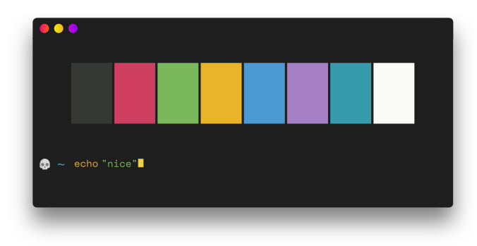  [Download](https://raw.githubusercontent.com/EliverLara/terminator-themes/master/schemes/Japanesque.config)  
**Jellybeans**  [Download](https://raw.githubusercontent.com/EliverLara/terminator-themes/master/schemes/Jellybeans.config)  | **Jetbrains darcula**  [Download](https://raw.githubusercontent.com/EliverLara/terminator-themes/master/schemes/JetBrains%20Darcula.config)  
**Juicy**  [Download](https://raw.githubusercontent.com/EliverLara/terminator-themes/master/schemes/Juicy.config)  | **Kibble**  [Download](https://raw.githubusercontent.com/EliverLara/terminator-themes/master/schemes/Kibble.config)  
**Later this evening**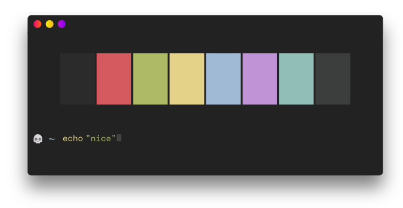  [Download](https://raw.githubusercontent.com/EliverLara/terminator-themes/master/schemes/Later%20This%20Evening.config)  | **Lavandula**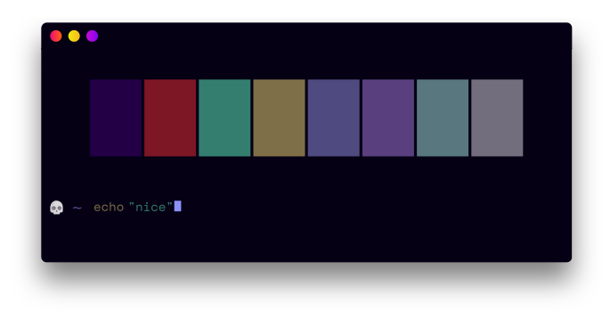  [Download](https://raw.githubusercontent.com/EliverLara/terminator-themes/master/schemes/Lavandula.config)  
**Liquidcarbon**  [Download](https://raw.githubusercontent.com/EliverLara/terminator-themes/master/schemes/LiquidCarbon.config)  | **Liquidcarbontransparent**  [Download](https://raw.githubusercontent.com/EliverLara/terminator-themes/master/schemes/LiquidCarbonTransparent.config)  
**Liquidcarbontransparentinverse**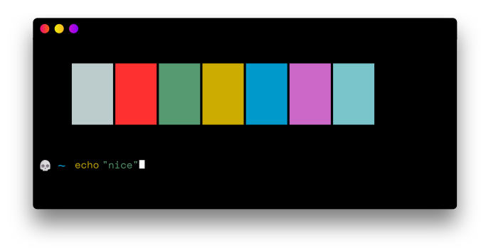  [Download](https://raw.githubusercontent.com/EliverLara/terminator-themes/master/schemes/LiquidCarbonTransparentInverse.config)  | **Man page**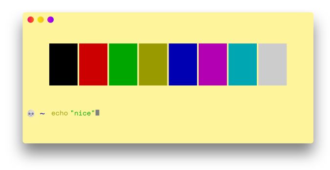  [Download](https://raw.githubusercontent.com/EliverLara/terminator-themes/master/schemes/Man%20Page.config)  
**Mar**  [Download](https://raw.githubusercontent.com/EliverLara/terminator-themes/master/schemes/Mar.config)  | **Material colors**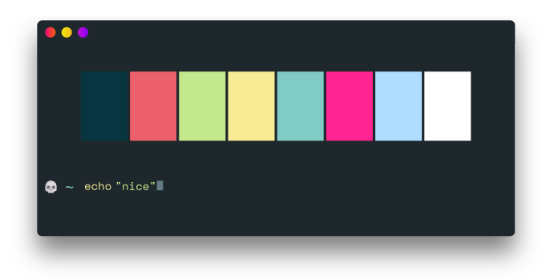  [Download](https://raw.githubusercontent.com/EliverLara/terminator-themes/master/schemes/Material%20colors.config)  
**Material**  [Download](https://raw.githubusercontent.com/EliverLara/terminator-themes/master/schemes/Material.config)  | **Materialdark**  [Download](https://raw.githubusercontent.com/EliverLara/terminator-themes/master/schemes/MaterialDark.config)  
**Mathias**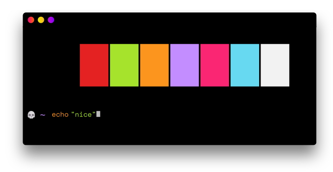  [Download](https://raw.githubusercontent.com/EliverLara/terminator-themes/master/schemes/Mathias.config)  | **Medallion**  [Download](https://raw.githubusercontent.com/EliverLara/terminator-themes/master/schemes/Medallion.config)  
**Misterioso**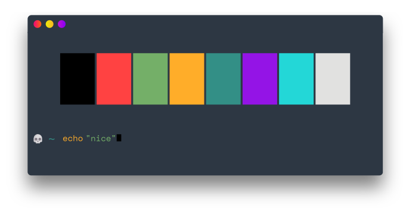  [Download](https://raw.githubusercontent.com/EliverLara/terminator-themes/master/schemes/Misterioso.config)  | **Miu**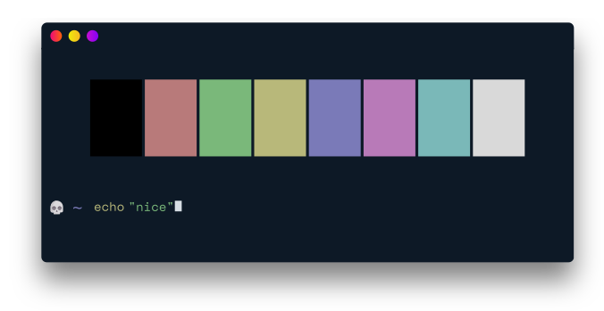  [Download](https://raw.githubusercontent.com/EliverLara/terminator-themes/master/schemes/Miu.config)  
**Molokai**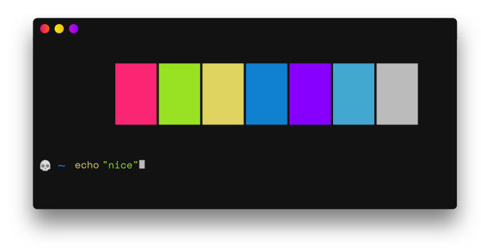  [Download](https://raw.githubusercontent.com/EliverLara/terminator-themes/master/schemes/Molokai.config)  | **Monalisa**  [Download](https://raw.githubusercontent.com/EliverLara/terminator-themes/master/schemes/MonaLisa.config)  
**Monokai dark**  [Download](https://raw.githubusercontent.com/EliverLara/terminator-themes/master/schemes/Monokai%20dark.config)  | **Monokai soda**  [Download](https://raw.githubusercontent.com/EliverLara/terminator-themes/master/schemes/Monokai%20Soda.config)  
**Monokai vivid**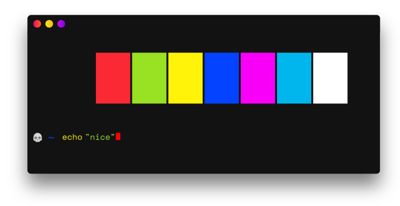  [Download](https://raw.githubusercontent.com/EliverLara/terminator-themes/master/schemes/Monokai%20Vivid.config)  | **N0tch2k**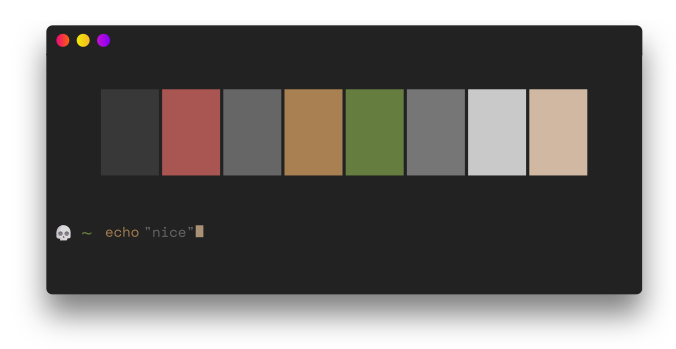  [Download](https://raw.githubusercontent.com/EliverLara/terminator-themes/master/schemes/N0tch2k.config)  
**Neopolitan**  [Download](https://raw.githubusercontent.com/EliverLara/terminator-themes/master/schemes/Neopolitan.config)  | **Neutron**  [Download](https://raw.githubusercontent.com/EliverLara/terminator-themes/master/schemes/Neutron.config)  
**Nightlion v1**  [Download](https://raw.githubusercontent.com/EliverLara/terminator-themes/master/schemes/NightLion%20v1.config)  | **Nightlion v2**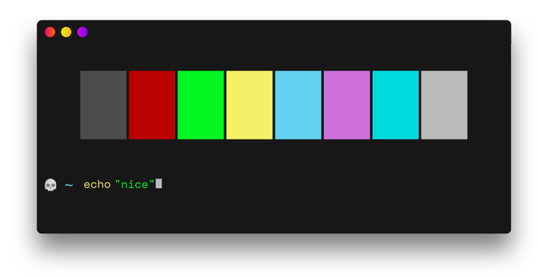  [Download](https://raw.githubusercontent.com/EliverLara/terminator-themes/master/schemes/NightLion%20v2.config)  
**Novel**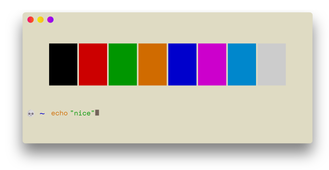  [Download](https://raw.githubusercontent.com/EliverLara/terminator-themes/master/schemes/Novel.config)  | **Obsidian**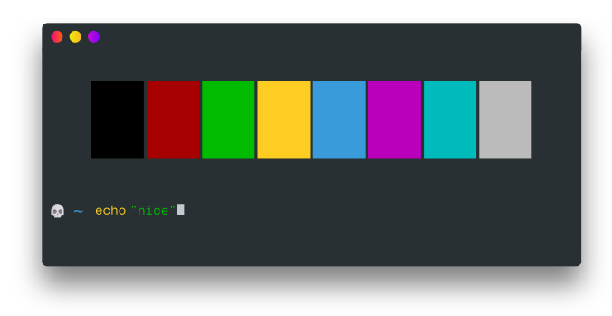  [Download](https://raw.githubusercontent.com/EliverLara/terminator-themes/master/schemes/Obsidian.config)  
**Ocean**  [Download](https://raw.githubusercontent.com/EliverLara/terminator-themes/master/schemes/Ocean.config)  | **Ocean dark**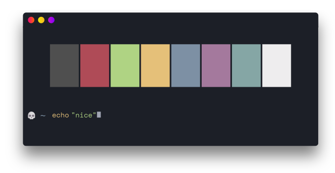  [Download](https://raw.githubusercontent.com/EliverLara/terminator-themes/master/schemes/Ocean%20dark.config)  
**Oceanicmaterial**  [Download](https://raw.githubusercontent.com/EliverLara/terminator-themes/master/schemes/OceanicMaterial.config)  | **Ollie**  [Download](https://raw.githubusercontent.com/EliverLara/terminator-themes/master/schemes/Ollie.config)  
**One dark**  [Download](https://raw.githubusercontent.com/EliverLara/terminator-themes/master/schemes/One%20dark.config)  | **Onehalfdark**  [Download](https://raw.githubusercontent.com/EliverLara/terminator-themes/master/schemes/OneHalfDark.config)  
**Onehalflight**  [Download](https://raw.githubusercontent.com/EliverLara/terminator-themes/master/schemes/OneHalfLight.config)  | **Pali**  [Download](https://raw.githubusercontent.com/EliverLara/terminator-themes/master/schemes/Pali.config)  
**Panda**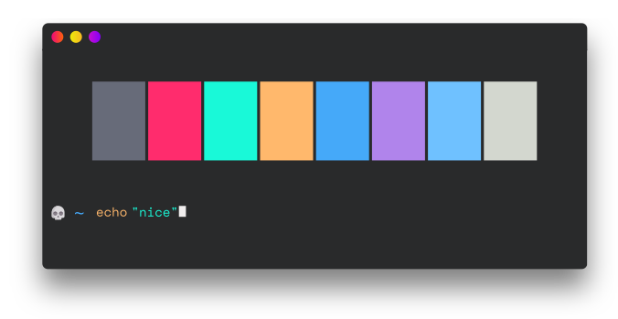  [Download](https://raw.githubusercontent.com/EliverLara/terminator-themes/master/schemes/Panda.config)  | **Pandora**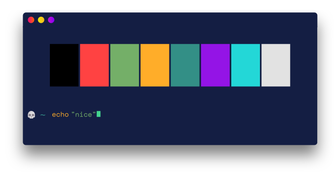  [Download](https://raw.githubusercontent.com/EliverLara/terminator-themes/master/schemes/Pandora.config)  
**Paraiso dark**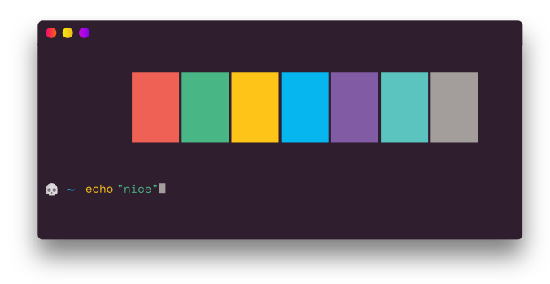  [Download](https://raw.githubusercontent.com/EliverLara/terminator-themes/master/schemes/Paraiso%20Dark.config)  | **Parasio dark**  [Download](https://raw.githubusercontent.com/EliverLara/terminator-themes/master/schemes/Parasio%20Dark.config)  
**Paulmillr**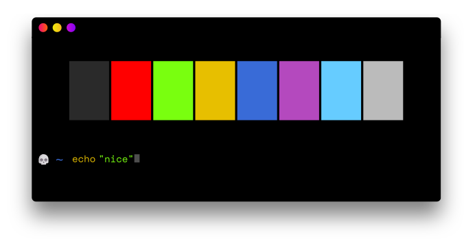  [Download](https://raw.githubusercontent.com/EliverLara/terminator-themes/master/schemes/PaulMillr.config)  | **Pencildark**  [Download](https://raw.githubusercontent.com/EliverLara/terminator-themes/master/schemes/PencilDark.config)  
**Pencillight**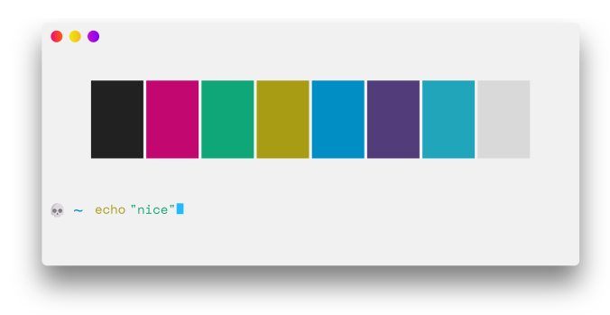  [Download](https://raw.githubusercontent.com/EliverLara/terminator-themes/master/schemes/PencilLight.config)  | **Peppermint**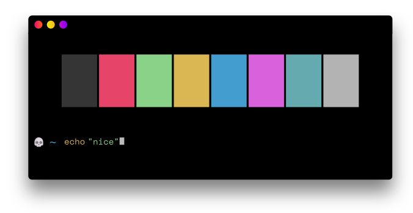  [Download](https://raw.githubusercontent.com/EliverLara/terminator-themes/master/schemes/Peppermint.config)  
**Piatto light**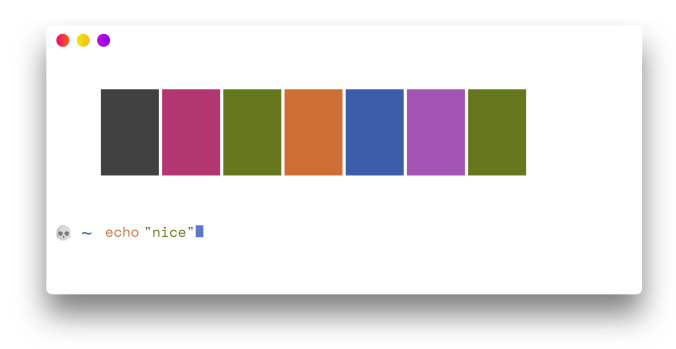  [Download](https://raw.githubusercontent.com/EliverLara/terminator-themes/master/schemes/Piatto%20Light.config)  | **Pnevma**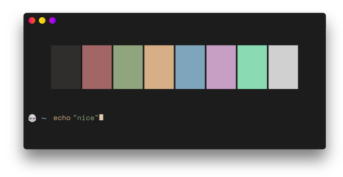  [Download](https://raw.githubusercontent.com/EliverLara/terminator-themes/master/schemes/Pnevma.config)  
**Pro**  [Download](https://raw.githubusercontent.com/EliverLara/terminator-themes/master/schemes/Pro.config)  | **Red alert**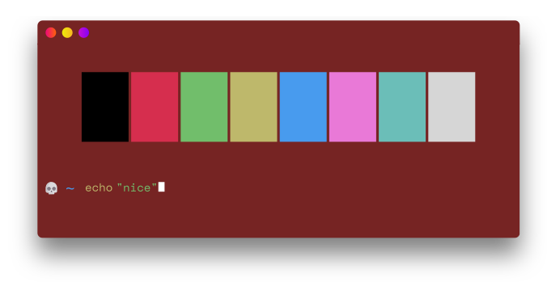  [Download](https://raw.githubusercontent.com/EliverLara/terminator-themes/master/schemes/Red%20Alert.config)  
**Red planet**  [Download](https://raw.githubusercontent.com/EliverLara/terminator-themes/master/schemes/Red%20Planet.config)  | **Red sands**  [Download](https://raw.githubusercontent.com/EliverLara/terminator-themes/master/schemes/Red%20Sands.config)  
**Rippedcasts**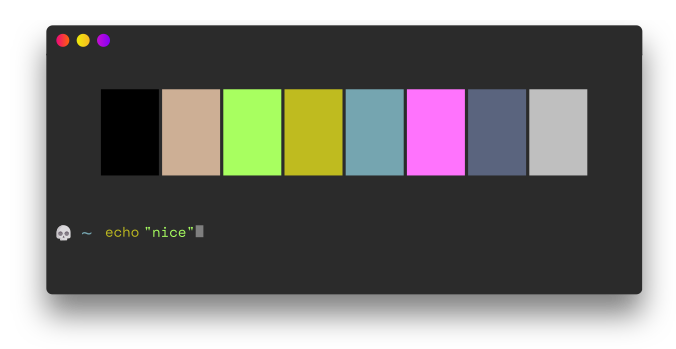  [Download](https://raw.githubusercontent.com/EliverLara/terminator-themes/master/schemes/Rippedcasts.config)  | **Royal**  [Download](https://raw.githubusercontent.com/EliverLara/terminator-themes/master/schemes/Royal.config)  
**Ryuuko**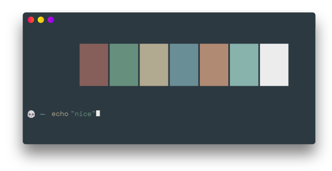  [Download](https://raw.githubusercontent.com/EliverLara/terminator-themes/master/schemes/Ryuuko.config)  | **Seafoam pastel**  [Download](https://raw.githubusercontent.com/EliverLara/terminator-themes/master/schemes/Seafoam%20Pastel.config)  
**Seashells**  [Download](https://raw.githubusercontent.com/EliverLara/terminator-themes/master/schemes/SeaShells.config)  | **Seti**  [Download](https://raw.githubusercontent.com/EliverLara/terminator-themes/master/schemes/Seti.config)  
**Shaman**  [Download](https://raw.githubusercontent.com/EliverLara/terminator-themes/master/schemes/Shaman.config)  | **Shel**  [Download](https://raw.githubusercontent.com/EliverLara/terminator-themes/master/schemes/Shel.config)  
**Slate**  [Download](https://raw.githubusercontent.com/EliverLara/terminator-themes/master/schemes/Slate.config)  | **Smyck**  [Download](https://raw.githubusercontent.com/EliverLara/terminator-themes/master/schemes/Smyck.config)  
**Snazzy**  [Download](https://raw.githubusercontent.com/EliverLara/terminator-themes/master/schemes/Snazzy.config)  | **Softserver**  [Download](https://raw.githubusercontent.com/EliverLara/terminator-themes/master/schemes/SoftServer.config)  
**Solarized darcula**  [Download](https://raw.githubusercontent.com/EliverLara/terminator-themes/master/schemes/Solarized%20Darcula.config)  | **Solarized dark**  [Download](https://raw.githubusercontent.com/EliverLara/terminator-themes/master/schemes/Solarized%20Dark.config)  
**Solarized dark higher contrast**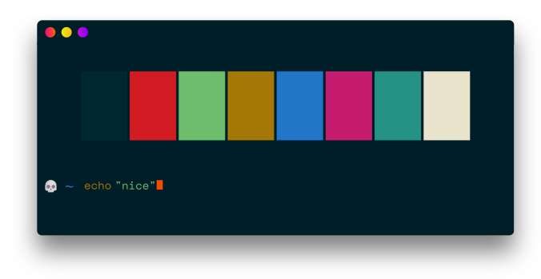  [Download](https://raw.githubusercontent.com/EliverLara/terminator-themes/master/schemes/Solarized%20Dark%20Higher%20Contrast.config)  | **Solarized dark - patched**  [Download](https://raw.githubusercontent.com/EliverLara/terminator-themes/master/schemes/Solarized%20Dark%20-%20Patched.config)  
**Solarized light**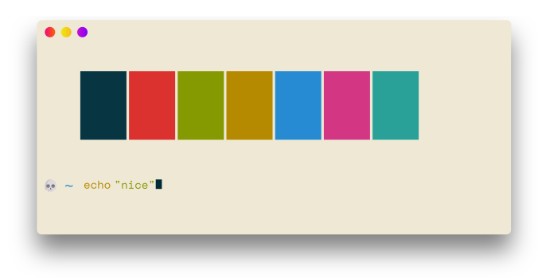  [Download](https://raw.githubusercontent.com/EliverLara/terminator-themes/master/schemes/Solarized%20Light.config)  | **Spacedust**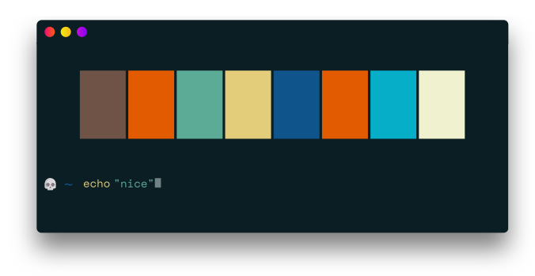  [Download](https://raw.githubusercontent.com/EliverLara/terminator-themes/master/schemes/Spacedust.config)  
**Spacegray**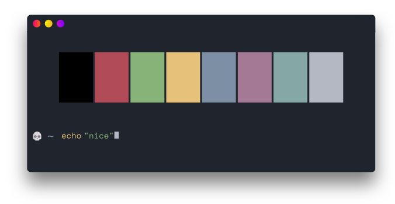  [Download](https://raw.githubusercontent.com/EliverLara/terminator-themes/master/schemes/SpaceGray.config)  | **Spacegray eighties**  [Download](https://raw.githubusercontent.com/EliverLara/terminator-themes/master/schemes/SpaceGray%20Eighties.config)  
**Spacegray eighties dull**  [Download](https://raw.githubusercontent.com/EliverLara/terminator-themes/master/schemes/SpaceGray%20Eighties%20Dull.config)  | **Spiderman**  [Download](https://raw.githubusercontent.com/EliverLara/terminator-themes/master/schemes/Spiderman.config)  
**Spring**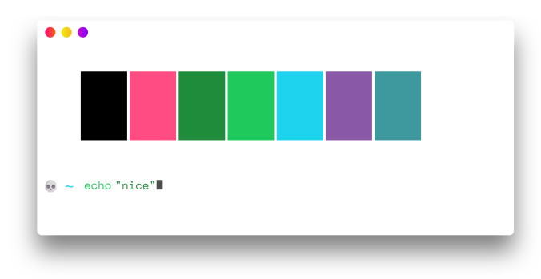  [Download](https://raw.githubusercontent.com/EliverLara/terminator-themes/master/schemes/Spring.config)  | **Square**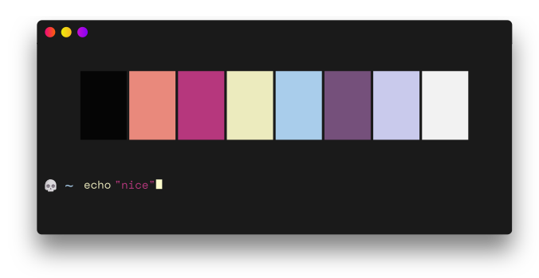  [Download](https://raw.githubusercontent.com/EliverLara/terminator-themes/master/schemes/Square.config)  
**Sundried**  [Download](https://raw.githubusercontent.com/EliverLara/terminator-themes/master/schemes/Sundried.config)  | **Symfonic**  [Download](https://raw.githubusercontent.com/EliverLara/terminator-themes/master/schemes/Symfonic.config)  
**Teerb**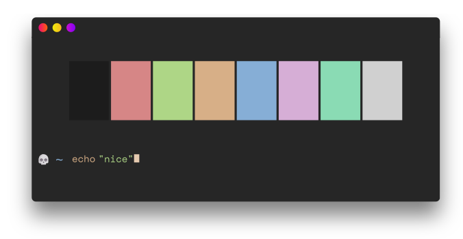  [Download](https://raw.githubusercontent.com/EliverLara/terminator-themes/master/schemes/Teerb.config)  | **Terminal basic**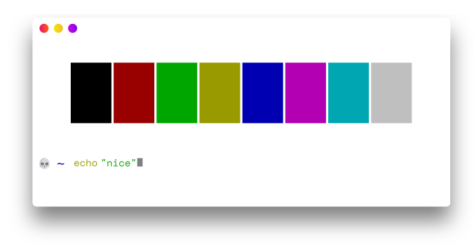  [Download](https://raw.githubusercontent.com/EliverLara/terminator-themes/master/schemes/Terminal%20Basic.config)  
**Thayer bright**  [Download](https://raw.githubusercontent.com/EliverLara/terminator-themes/master/schemes/Thayer%20Bright.config)  | **The hulk**  [Download](https://raw.githubusercontent.com/EliverLara/terminator-themes/master/schemes/The%20Hulk.config)  
**Tomorrow**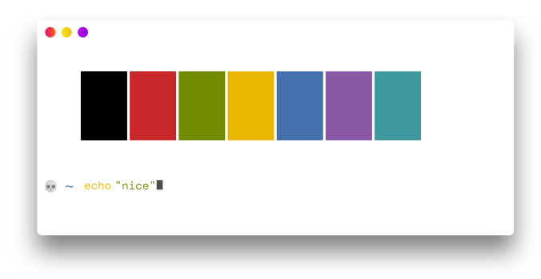  [Download](https://raw.githubusercontent.com/EliverLara/terminator-themes/master/schemes/Tomorrow.config)  | **Tomorrow night blue**  [Download](https://raw.githubusercontent.com/EliverLara/terminator-themes/master/schemes/Tomorrow%20Night%20Blue.config)  
**Tomorrow night bright**  [Download](https://raw.githubusercontent.com/EliverLara/terminator-themes/master/schemes/Tomorrow%20Night%20Bright.config)  | **Tomorrow night**  [Download](https://raw.githubusercontent.com/EliverLara/terminator-themes/master/schemes/Tomorrow%20Night.config)  
**Tomorrow night eighties**  [Download](https://raw.githubusercontent.com/EliverLara/terminator-themes/master/schemes/Tomorrow%20Night%20Eighties.config)  | **Toychest**  [Download](https://raw.githubusercontent.com/EliverLara/terminator-themes/master/schemes/ToyChest.config)  
**Treehouse**  [Download](https://raw.githubusercontent.com/EliverLara/terminator-themes/master/schemes/Treehouse.config)  | **Twilight**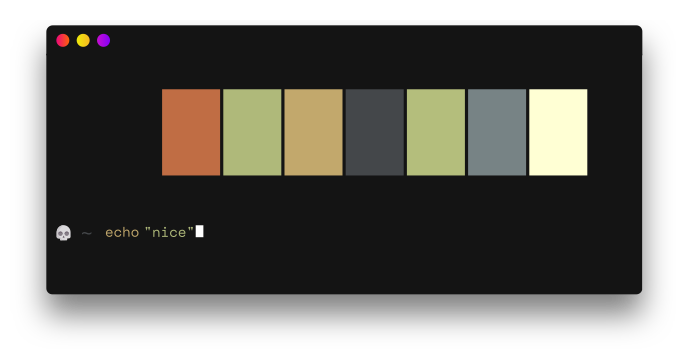  [Download](https://raw.githubusercontent.com/EliverLara/terminator-themes/master/schemes/Twilight.config)  
**Ubuntu**  [Download](https://raw.githubusercontent.com/EliverLara/terminator-themes/master/schemes/Ubuntu.config)  | **Underthesea**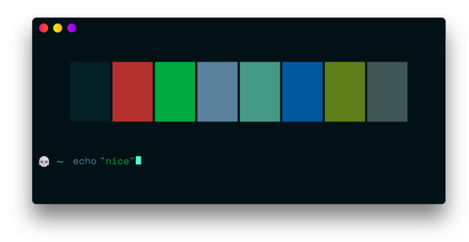  [Download](https://raw.githubusercontent.com/EliverLara/terminator-themes/master/schemes/UnderTheSea.config)  
**Urple**  [Download](https://raw.githubusercontent.com/EliverLara/terminator-themes/master/schemes/Urple.config)  | **Vag**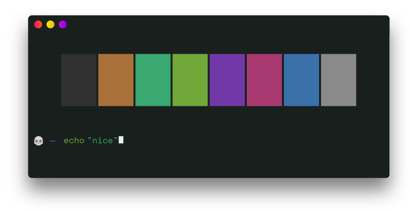  [Download](https://raw.githubusercontent.com/EliverLara/terminator-themes/master/schemes/Vag.config)  
**Vaughn**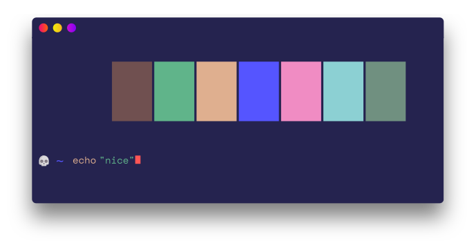  [Download](https://raw.githubusercontent.com/EliverLara/terminator-themes/master/schemes/Vaughn.config)  | **Vibrantink**  [Download](https://raw.githubusercontent.com/EliverLara/terminator-themes/master/schemes/VibrantInk.config)  
**Violet dark**  [Download](https://raw.githubusercontent.com/EliverLara/terminator-themes/master/schemes/Violet%20Dark.config)  | **Violet light**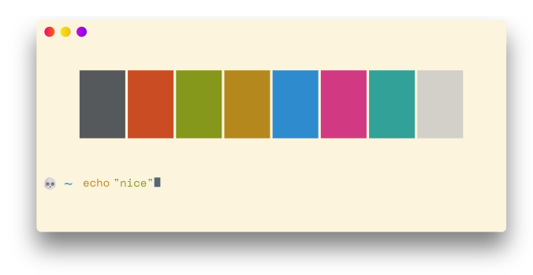  [Download](https://raw.githubusercontent.com/EliverLara/terminator-themes/master/schemes/Violet%20Light.config)  
**Warmneon**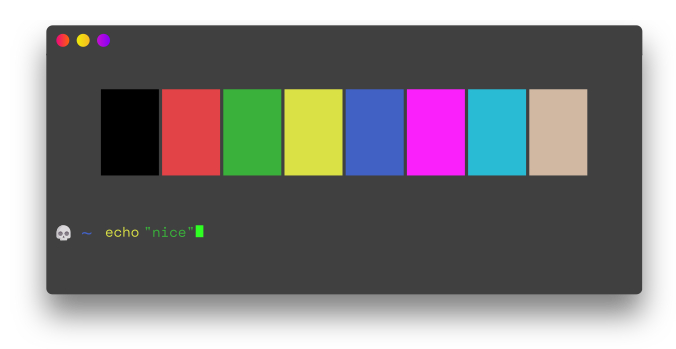  [Download](https://raw.githubusercontent.com/EliverLara/terminator-themes/master/schemes/WarmNeon.config)  | **Wez**  [Download](https://raw.githubusercontent.com/EliverLara/terminator-themes/master/schemes/Wez.config)  
**Wildcherry**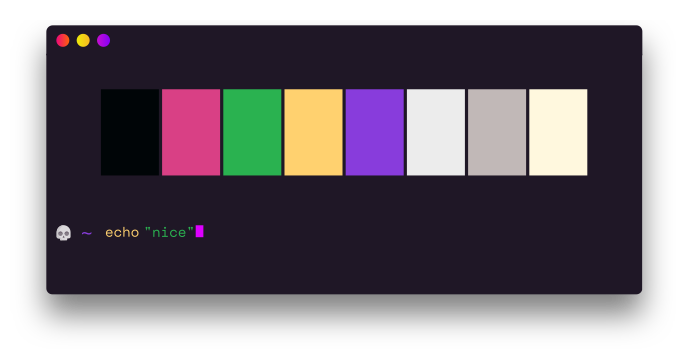  [Download](https://raw.githubusercontent.com/EliverLara/terminator-themes/master/schemes/WildCherry.config)  | **Wombat**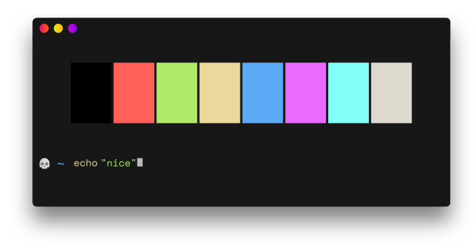  [Download](https://raw.githubusercontent.com/EliverLara/terminator-themes/master/schemes/Wombat.config)  
**Wryan**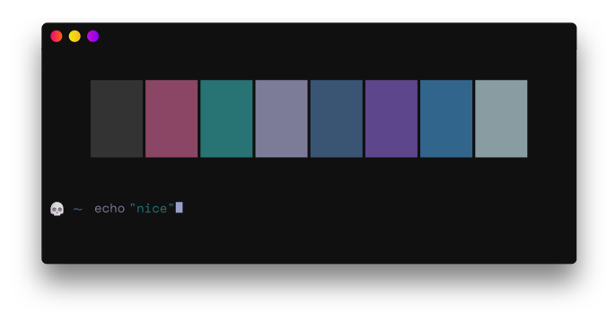  [Download](https://raw.githubusercontent.com/EliverLara/terminator-themes/master/schemes/Wryan.config)  | **Zenburn**  [Download](https://raw.githubusercontent.com/EliverLara/terminator-themes/master/schemes/Zenburn.config)  

[⬆ Back to top](#contents)